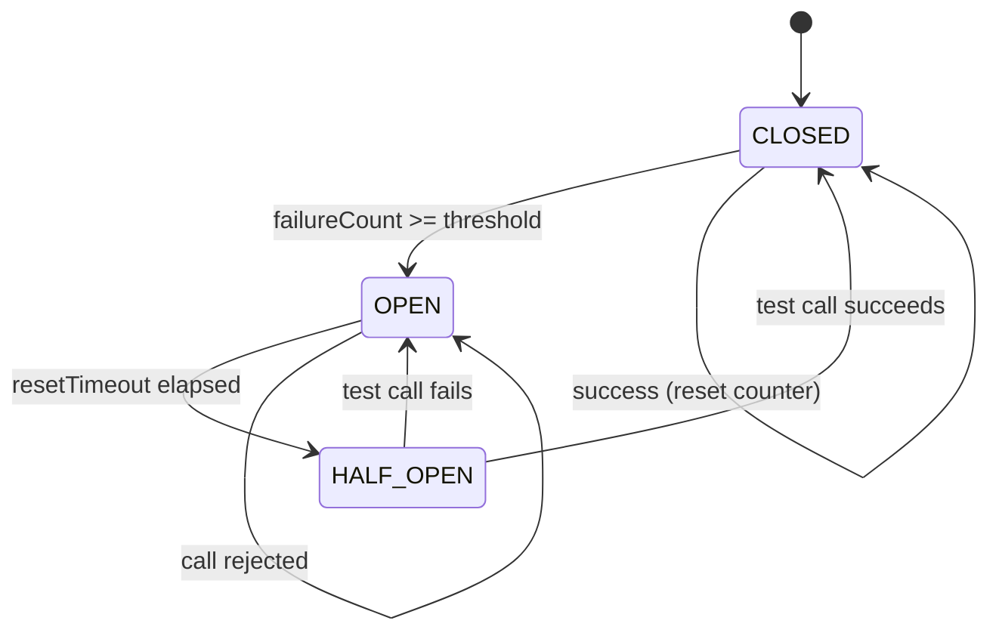

# Circuit Breaker

## Définition

Le pattern Circuit Breaker protège une application contre les appels répétés à un service défaillant. Comme un disjoncteur électrique, il "ouvre le circuit" après un nombre d'échecs consécutifs, rejetant immédiatement les appels suivants pendant un temps de repos, puis laisse passer un appel de test ("half-open") pour vérifier si le service a récupéré.

## Problème

Un service de paiement appelle une API bancaire externe. Quand cette API tombe en panne, chaque requête client attend le timeout complet (30 secondes) avant d'échouer. Avec des milliers de requêtes simultanées, les threads se bloquent, les ressources s'épuisent et l'application entière devient indisponible -- un simple problème externe provoque un effondrement en cascade.

## Solution

Un `CircuitBreaker` enveloppe les appels au service externe et suit trois états :

1. **CLOSED** (nominal) : les appels passent normalement. Les échecs sont comptés.
2. **OPEN** : le seuil d'échecs est atteint. Tous les appels sont rejetés immédiatement avec une `CircuitOpenException`, sans contacter le service.
3. **HALF_OPEN** : après un délai de repos, un appel de test est autorisé. S'il réussit, le circuit se ferme. S'il échoue, le circuit se rouvre.

## Quand l'utiliser

- Pour les appels à des services externes non fiables (APIs tierces par exemple)
- Quand les timeouts bloquants peuvent provoquer un effondrement en cascade
- Pour offrir un mode dégradé rapide plutôt qu'une attente
- Dans les architectures microservices où la résilience inter-services est critique

## Quand éviter

- Pour des appels locaux qui ne peuvent pas échouer de manière transitoire
- Si le service appelé a des temps de réponse constants
- Quand un simple retry suffit (erreurs rares et passagères)
- Pour des opérations critiques qui doivent toujours être tentées, même si le service est défaillant

## Schéma

Commande pour exécuter :
`./gradlew :patterns:advanced:circuit-breaker:test`

## Trade-offs

| Avantages | Inconvénients |
|---|---|
| Fail-fast : rejet immédiat au lieu d'un timeout bloquant | Rejets légitimes pendant la phase OPEN (faux négatifs) |
| Protection contre les effondrements en cascade | Complexité ajoutée au flux d'appel |
| Détection automatique de la récupération (HALF_OPEN) | Le calibrage du seuil et du timeout est délicat |
| Monitoring naturel via les transitions d'état | Pas de distinction entre types d'erreurs (toutes comptent) |

## À retenir

1. Le Circuit Breaker **protège l'ensemble du système** quand un service est défaillant : il échoue vite au lieu de bloquer les ressources en attente.
2. Les trois états (CLOSED → OPEN → HALF_OPEN) forment un cycle d'**auto-guérison** : le circuit se rétablit automatiquement quand le service revient.
3. Il évite l'**effet cascade** : sans lui, un service lent peut saturer les threads de tous ses appelants et provoquer une panne en chaîne.
4. Le calibrage (seuil d'échecs, timeout de reset) est un levier opérationnel clé qui dépend du SLA du service cible.
5. Combiné avec le Retry, il forme le duo standard de résilience : le retry gère les erreurs ponctuelles, le circuit protège contre les pannes durables.
