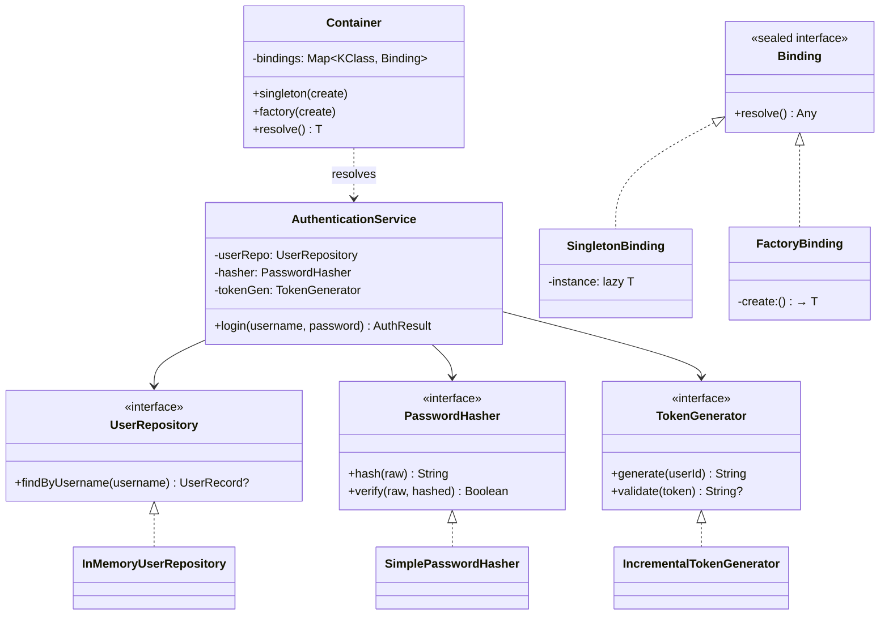

# Dependency Injection

## Définition

Le pattern Dependency Injection (DI) consiste à fournir les dépendances d'un objet de l'extérieur plutôt que de les créer en interne. L'objet déclare ses besoins via des paramètres de constructeur (constructor injection), et un **conteneur** ou une **composition root** se charge de l'assemblage.

## Problème

Un service d'authentification doit accéder à un dépôt d'utilisateurs, un hasher de mots de passe et un générateur de tokens. Si ces dépendances sont instanciées en dur dans le service, il est impossible de les remplacer pour les tests, de changer d'algorithme de hachage, ou d'utiliser un stockage différent sans modifier le code du service.

## Solution

Le `AuthenticationService` déclare ses trois dépendances comme paramètres de constructeur : `UserRepository`, `PasswordHasher` et `TokenGenerator`. Chaque dépendance est une interface et les implémentations concrètes sont interchangeables.

Un `Container` joue le rôle de **composition root** : il centralise l'enregistrement des bindings et leur résolution. Il supporte deux cycles de vie :

- **singleton** : une seule instance créée au premier appel (`by lazy`), réutilisée à chaque `resolve()`
- **factory** : une nouvelle instance créée à chaque `resolve()`

## Quand l'utiliser

- Quand un composant a des dépendances qui doivent pouvoir être substituées (tests, environnements multiples)
- Pour respecter le principe d'inversion de dépendance (DIP) : dépendre d'abstractions, pas d'implémentations
- Quand on veut que le code métier soit testable facilement
- Pour faciliter la configuration par environnement (dev, staging, production)

## Quand éviter

- Pour des objets simples sans dépendances externes
- Quand l'ajout d'interfaces et d'injection complexifie inutilement un code trivial
- Pour des utilitaires purs sans état ni effets de bord

## Schéma

Commande pour exécuter :
`./gradlew :patterns:advanced:dependency-injection:test`

## Trade-offs

| Avantages | Inconvénients |
|---|---|
| Testabilité totale via doublures de test | L'assemblage doit être fait quelque part (container, main) |
| Respect du DIP et de l'Open/Closed Principle | Plus de classes et d'interfaces qu'une approche directe |
| Changement d'implémentation en un seul point | La navigation dans le code est moins directe (indirection) |
| Gestion des cycles de vie (singleton/factory) |  |

## À retenir

1. La DI sépare **création** et **utilisation** des dépendances : un objet ne sait jamais d'où viennent ses collaborateurs.
2. Dépendre d'**abstractions** (interfaces), pas d'implémentations concrètes — c'est le principe d'inversion de dépendance (DIP).
3. La **testabilité** est un bénéfice direct : remplacer une dépendance par un double de test ne demande aucune modification du code métier.
4. L'assemblage des dépendances doit être centralisé dans une **composition root** — un seul endroit qui décide "qui reçoit quoi".
