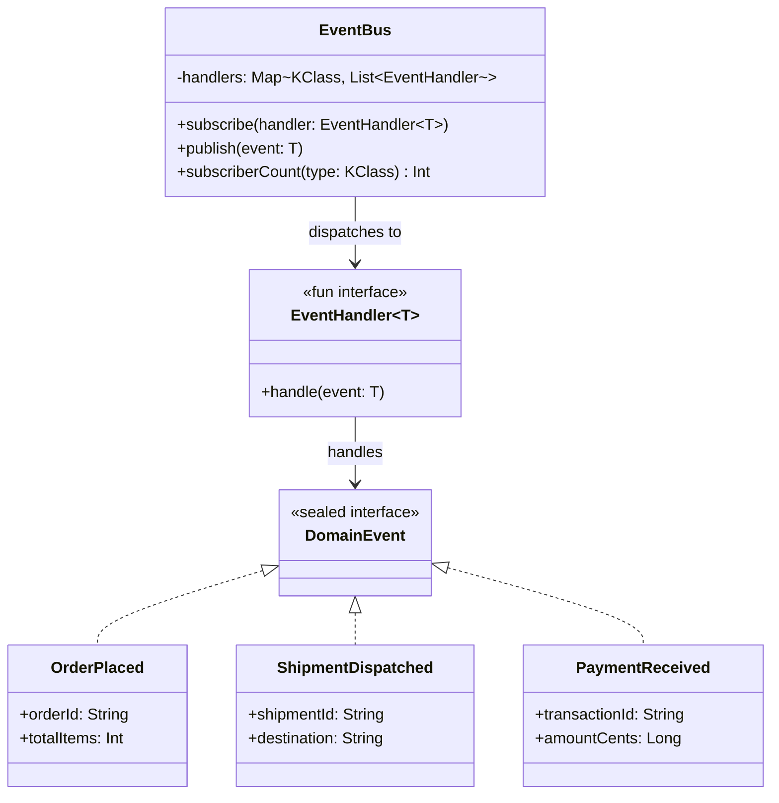

# Event Bus

## Définition

Le pattern Event Bus fournit un mécanisme de publication/souscription (pub/sub) qui découple les producteurs d'événements de leurs consommateurs. Les composants publient des événements sur le bus sans connaître les handlers, et les handlers s'abonnent aux types d'événements qui les intéressent sans connaître les producteurs.

## Problème

Dans un système e-commerce, quand une commande est passée, il faut notifier l'entrepôt, mettre à jour le stock, envoyer un email de confirmation et déclencher la facturation. Si le service de commande appelle directement chacun de ces modules, il devient un point de couplage central : chaque nouveau besoin nécessite de modifier le code de création de commande.

## Solution

Un `EventBus` centralise le routage des événements. Les modules s'abonnent aux types d'événements qui les concernent (`OrderPlaced`, `ShipmentDispatched`, `PaymentReceived`). Quand un événement est publié, le bus le distribue à tous les handlers enregistrés pour ce type. Les producteurs et consommateurs ne se connaissent pas.

Les événements sont modélisés par une `sealed interface DomainEvent` et les handlers par un `fun interface EventHandler<T>`.

## Quand l'utiliser

- Pour découpler les modules d'une application monolithique (notifications, audit, analytics)
- Quand de nouveaux consommateurs d'événements doivent pouvoir être ajoutés sans modifier les producteurs
- Pour implémenter des side effects (envoi d'email, logging, mise à jour de cache) de manière déclarative
- Dans les architectures orientées événements (event-driven) ou CQRS

## Quand éviter

- Quand l'ordre d'exécution des handlers est critique et doit être garanti
- Pour des interactions requête/réponse synchrones (le bus est fire-and-forget)
- Si le nombre d'événements est très faible et le couplage direct est acceptable

## Schéma

Commande pour exécuter :
`./gradlew :patterns:advanced:event-bus:test`

## Trade-offs

| Avantages | Inconvénients |
|---|---|
| Découplage total entre producteurs et consommateurs | Le flux de contrôle est implicite (difficile à tracer) |
| Ajout de nouveaux handlers sans modifier les producteurs | Pas de garantie d'ordre d'exécution des handlers |
| Architecture extensible et modulaire | Les erreurs dans un handler sont collectées et remontées via `EventDeliveryException` |
| Testable : chaque handler est une unité indépendante | Le typage repose sur un cast interne (sûr mais non vérifié par le compilateur) |

## À retenir

1. L'Event Bus découple **totalement** producteurs et consommateurs : ils n'ont aucune connaissance l'un de l'autre, seul l'événement les relie.
2. Ajouter un nouveau consommateur ne nécessite **aucune modification** du producteur -> extensibilité maximale.
3. Le pattern est fondamental dans les architectures **event-driven**, CQRS et les systèmes à plugins.
4. Il permet de transformer une architecture couplée en un système où les modules communiquent par **messages**, pas par appels directs.
5. Le trade-off principal est la **traçabilité** : documenter quels handlers réagissent à quels événements est essentiel en maintenance.
