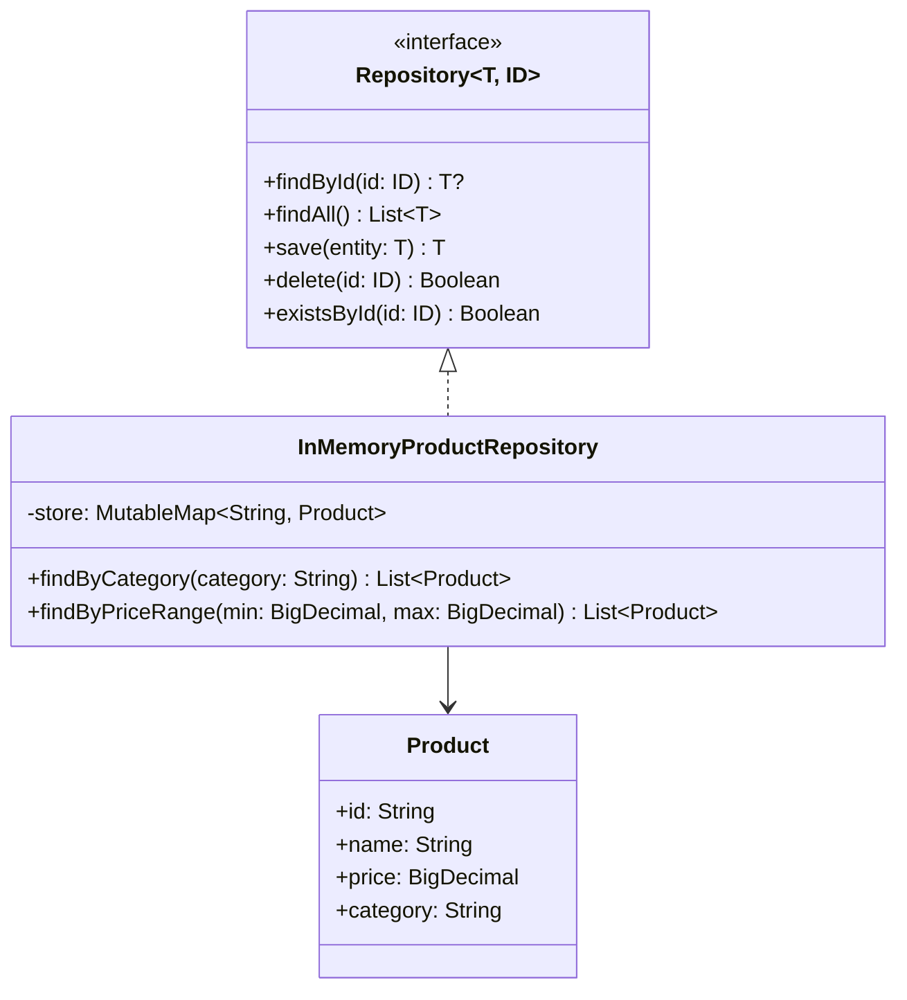

# Repository

## Définition

Le pattern Repository fournit une abstraction entre la logique métier et la couche d'accès aux données. Il expose des opérations CRUD via une interface générique, permettant de changer de mécanisme de stockage (mémoire, base de données, API distante) sans impacter le domaine.

## Problème

Dans une plateforme e-commerce, le code métier (calcul de prix, gestion de stock, recherche produit) accède directement à la base de données. Chaque changement d'infrastructure (migration de PostgreSQL vers MongoDB, ajout d'un cache Redis) nécessite de modifier la logique métier. Les tests unitaires deviennent impossibles sans base de données réelle.

## Solution

On introduit une interface `Repository<T, ID>` qui définit les opérations standard (`findById`, `findAll`, `save`, `delete`, `existsById`). L'implémentation concrète (`InMemoryProductRepository`) encapsule les détails de stockage. Le code métier ne dépend que de l'interface, jamais de l'implémentation.

L'implémentation in-memory ajoute des requêtes spécifiques au domaine (`findByCategory`, `findByPriceRange`) tout en respectant le contrat générique.

## Quand l'utiliser

- Lorsqu'on veut découpler la logique métier de la persistance
- Quand plusieurs mécanismes de stockage sont envisagés (in-memory pour les tests, JDBC/ORM en production)
- Pour centraliser les requêtes d'accès aux données et éviter la duplication
- Quand les tests unitaires doivent fonctionner sans infrastructure externe

## Quand éviter

- Pour des applications triviales avec un seul type de stockage définitif
- Si le framework utilisé fournit déjà une abstraction repository (Spring Data, Exposed DAO)
- Quand l'ajout d'une couche d'indirection n'apporte pas de valeur (CRUD pur sans logique métier)

## Schéma

Commande pour exécuter :
`./gradlew :patterns:advanced:repository:test`

## Trade-offs

| Avantages | Inconvénients |
|---|---|
| Découplage total entre domaine et persistance | Couche d'indirection supplémentaire |
| Tests unitaires sans infrastructure | Risque de divergence entre implémentation in-memory et production |
| Changement de stockage transparent | Les requêtes complexes peuvent être difficiles à abstraire |
| Centralisation des accès données | Peut masquer les performances réelles du stockage |

## À retenir

1. Le Repository **isole le domaine de la persistance** : le code métier ne sait pas (et n'a pas besoin de savoir) comment les données sont stockées.
2. Changer de base de données, migrer vers un cache ou passer en mémoire revient à **substituer une implémentation** -> zéro changement métier.
3. Les tests deviennent rapides et déterministes grâce à l'implémentation in-memory, sans base de données ni infrastructure.
4. L'interface générique (`Repository<T, ID>`) offre un contrat CRUD réutilisable ; les requêtes spécifiques se placent dans l'implémentation concrète.
5. Le pattern est le fondement de la Clean Architecture : il matérialise la frontière entre domaine et infrastructure.
