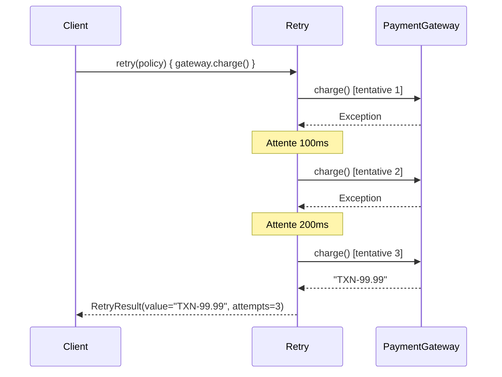

# Retry with Backoff

## Définition

Le pattern Retry with Exponential Backoff réessaie automatiquement une opération qui échoue, en augmentant progressivement le délai entre chaque tentative. Cela permet de surmonter les erreurs transitoires (réseau, service temporairement indisponible) sans surcharger le système cible.

## Problème

Une passerelle de paiement est temporairement indisponible. L'application tente de facturer le client, échoue, et retourne immédiatement une erreur. Le client voit un échec alors que la passerelle aurait été disponible 200 ms plus tard. Réessayer immédiatement en boucle risque de surcharger la passerelle déjà fragile.

## Solution

On encapsule la logique de réessai dans une fonction générique `retry()` qui :
1. Exécute l'action
2. En cas de succès, retourne immédiatement le résultat
3. En cas d'échec, attend un délai croissant (exponentiel) avant de réessayer
4. Après épuisement des tentatives, retourne un résultat d'échec avec la dernière erreur

La configuration est externalisée dans un objet `RetryPolicy` (nombre max de tentatives, délai initial, multiplicateur).

## Quand l'utiliser

- Pour les appels réseau vers des services externes (APIs, bases de données, passerelles de paiement)
- Quand les erreurs transitoires sont fréquentes et prévisibles
- Pour améliorer la résilience sans complexifier le code appelant
- Quand le service cible a un mécanisme de rate limiting (le backoff évite d'aggraver la surcharge)

## Quand éviter

- Pour des erreurs permanentes (identifiants invalides, ressource inexistante)
- Quand l'opération n'est pas idempotente (risque de double exécution)
- Si le délai total des réessais dépasse le timeout acceptable pour l'utilisateur
- Pour des opérations locales qui ne subissent pas d'erreurs transitoires

## Schéma

Commande pour exécuter :
`./gradlew :patterns:advanced:retry-backoff:test`

## Trade-offs

| Avantages | Inconvénients |
|---|---|
| Absorbe les erreurs transitoires de manière transparente | Augmente la latence totale en cas d'échec (somme des délais) |
| Backoff exponentiel évite de surcharger le service cible | L'opération doit être idempotente pour être retryable en sécurité |
| Configuration externalisée et flexible | Peut masquer des erreurs systémiques si mal configuré |
| Testable sans délais réels grâce au sleeper injectable | Le nombre de tentatives et les délais doivent être calibrés avec soin |

## À retenir

1. Le Retry transforme une **erreur transitoire** (timeout, indisponibilité momentanée) en succès transparent pour l'appelant.
2. Le backoff exponentiel protège le service cible : au lieu d'aggraver une surcharge, on lui laisse le temps de récupérer.
3. Le pattern rend les systèmes distribués **résilients** sans que le code métier ne gère la complexité des pannes réseau.
4. Ne jamais retry des opérations **non idempotentes** ou des erreurs **permanentes** (400, 404).
5. La combinaison Retry + Circuit Breaker forme le duo standard de résilience dans les architectures microservices.
