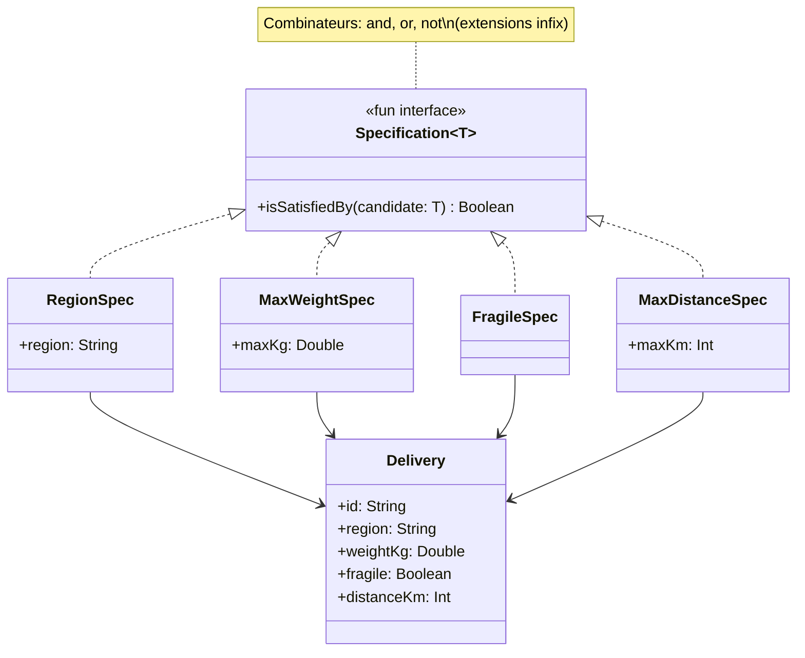

# Specification

## Définition

Le pattern Specification encapsule une règle métier booléenne dans un objet réutilisable et composable. Chaque spécification répond à la question "est-ce que ce candidat satisfait cette règle ?". Les spécifications se combinent avec des opérateurs logiques (`and`, `or`, `not`) pour exprimer des critères complexes de manière déclarative.

## Problème

Dans un système de logistique, les règles de filtrage des livraisons sont dispersées dans le code : filtrer par région ici, par poids là, par fragilité ailleurs. Chaque nouvelle règle nécessite de modifier les méthodes existantes. Les combinaisons de règles deviennent des cascades de `if` imbriqués, difficiles à tester et à maintenir.

## Solution

On extrait chaque règle métier dans une classe `Specification<T>` avec une méthode `isSatisfiedBy(candidate)`. Les opérateurs `and`, `or` et `not` permettent de composer des spécifications arbitrairement complexes. Le filtrage se fait en appliquant une spécification à une liste, sans modifier les objets métier.

## Quand l'utiliser

- Lorsque les règles métier de filtrage ou validation sont nombreuses et évoluent fréquemment
- Quand les mêmes règles doivent être réutilisées dans différents contextes (filtrage, validation, autorisation)
- Pour exprimer des critères combinés de manière lisible et testable unitairement
- Quand on veut éviter les cascades de `if/else` dans le code métier

## Quand éviter

- Pour un seul critère simple qui ne sera jamais composé
- Si la logique de filtrage est triviale et ne justifie pas l'abstraction
- Si le domaine n'a pas de règles métier combinatoires

## Schéma

Commande pour exécuter :
`./gradlew :patterns:advanced:specification:test`

## Trade-offs

| Avantages | Inconvénients |
|---|---|
| Règles métier nommées, réutilisables et testables | Nombre de classes potentiellement élevé si beaucoup de règles |
| Composition déclarative et lisible | Indirection supplémentaire par rapport à un simple `filter { ... }` |
| Ouvert à l'extension (nouvelles specs sans modifier l'existant) | Débogage plus complexe avec des compositions profondes |
| Chaque règle est testable unitairement | Peut être over-engineering pour des filtres simples |

## À retenir

1. Le Specification transforme chaque règle métier en un **objet autonome** : nommé, testable et réutilisable dans différents contextes.
2. La composition (`and`, `or`, `not`) permet de construire des filtres **arbitrairement complexes** sans dupliquer de logique.
3. Les règles deviennent des briques combinables : le métier peut exprimer des critères que le développeur n'avait pas anticipés.
4. Le pattern brille quand les règles sont **nombreuses, combinatoires et évolutives** -> pricing, éligibilité, recherche avancée.
5. Il élimine la duplication des conditions `if` dispersées dans le code au profit d'un vocabulaire métier explicite.
