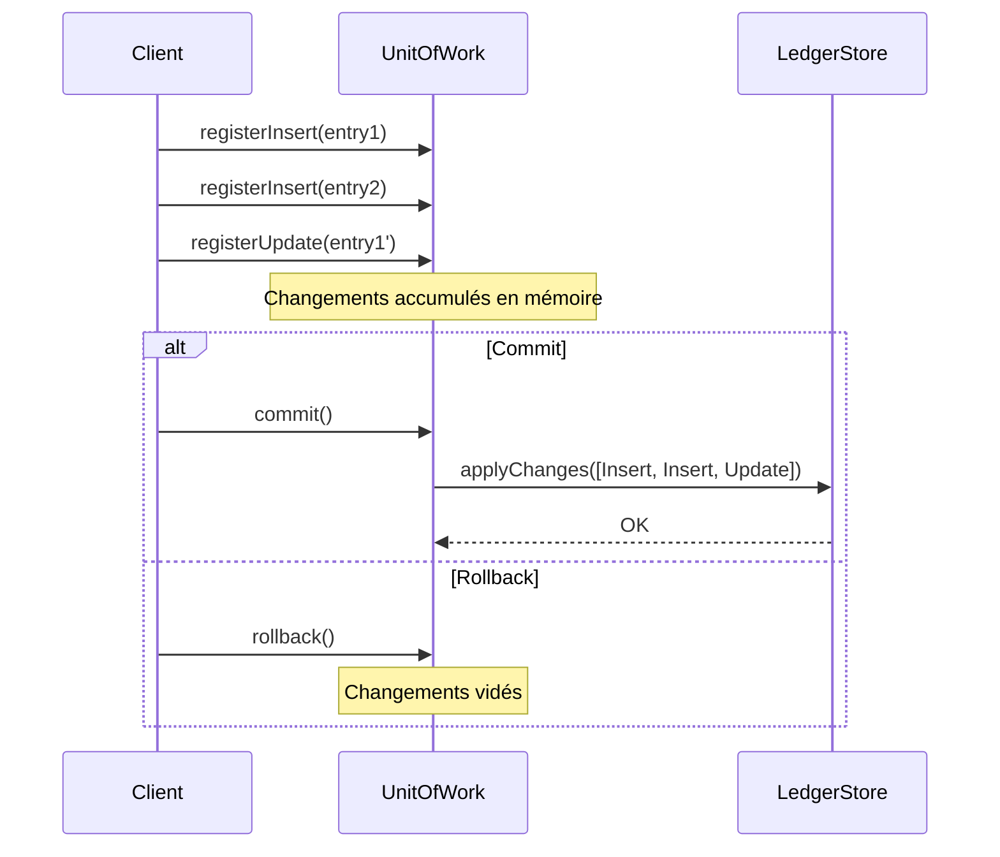

# Unit of Work

## Définition

Le pattern Unit of Work regroupe un ensemble de modifications (insertions, mises à jour, suppressions) en une seule transaction logique. Les changements sont accumulés en mémoire puis appliqués en une seule opération atomique lors du `commit`, ou abandonnés via un `rollback`.

## Problème

Dans un système de comptabilité, chaque écriture au grand livre (ledger) est envoyée individuellement à la base de données. Si une erreur survient au milieu d'un lot d'écritures, certaines sont persistées et d'autres non, laissant le système dans un état incohérent. De plus, les appels multiples à la base de données dégradent les performances.

## Solution

On crée un objet `UnitOfWork` qui accumule les changements (`Insert`, `Update`, `Delete`) sans les appliquer immédiatement. Le `LedgerStore` reçoit la liste complète des changements uniquement lors du `commit`. Si quelque chose ne va pas, `rollback` vide les changements accumulés.

Les changements sont modélisés par une `sealed interface Change` qui garantit l'exhaustivité du `when` lors de leur application.

## Quand l'utiliser

- Quand plusieurs modifications doivent être appliquées de manière atomique (tout ou rien)
- Pour regrouper les accès base de données et réduire les allers-retours réseau
- Quand on veut pouvoir annuler un ensemble de modifications avant de les persister
- Dans les systèmes où la cohérence des données est critique (comptabilité, paiement, inventaire)

## Quand éviter

- Pour des opérations unitaires qui ne nécessitent pas de regroupement
- Si la complexité de gestion des changements dépasse le bénéfice de l'atomicité
- Pour des opérations en lecture seule

## Schéma

Commande pour exécuter :
`./gradlew :patterns:advanced:unit-of-work:test`

## Trade-offs

| Avantages | Inconvénients |
|---|---|
| Atomicité des changements (tout ou rien) | Mémoire consommée par l'accumulation des changements |
| Réduction des allers-retours base de données | Complexité accrue par rapport aux opérations directes |
| Possibilité de rollback avant commit | Le Unit of Work est à usage unique (non réutilisable après commit) |
| Traçabilité des changements via `pendingChanges()` | Pas de véritable rollback après commit (nécessiterait une compensation) |

## À retenir

1. Le Unit of Work garantit l'**atomicité** : tous les changements sont appliqués ensemble ou pas du tout, évitant les états incohérents.
2. Il accumule les modifications en mémoire et les applique en un seul `commit`, réduisant les allers-retours avec le stockage.
3. Le pattern rend les opérations **réversibles** avant le commit : on peut inspecter, valider ou annuler les changements accumulés.
4. C'est le fondement des ORM modernes (Hibernate flush, Entity Framework SaveChanges) et des systèmes transactionnels.
5. La séparation entre l'accumulation (Unit of Work) et le stockage (Store) permet de tester la logique transactionnelle isolément.
