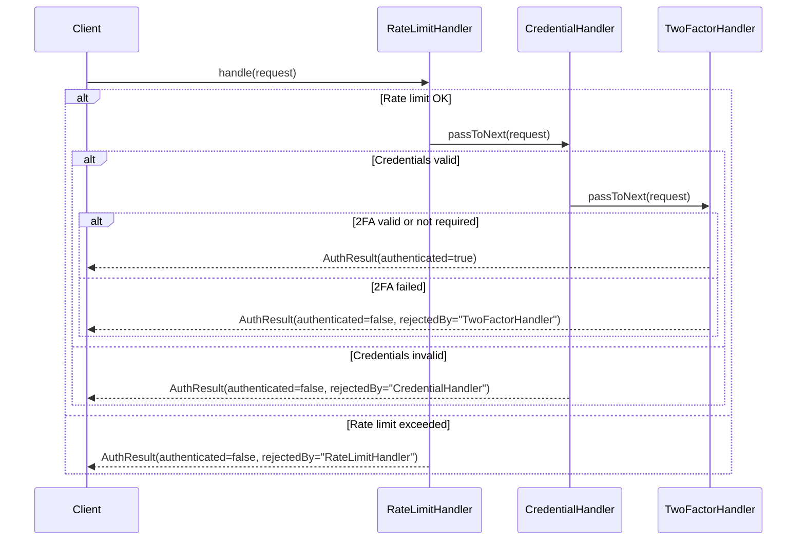

# Chain of Responsibility

## Définition

Le pattern Chain of Responsibility permet de faire transiter une requête le long d'une chaîne de handlers. Chaque handler décide soit de traiter la requête, soit de la passer au suivant. Le client n'a pas besoin de connaître quel handler traitera sa requête.

## Problème

Un système d'authentification doit vérifier successivement plusieurs critères avant d'autoriser un utilisateur : le rate limiting (protection anti-brute-force), la validité des credentials, et éventuellement l'authentification a deux facteurs (2FA). Coder ces vérifications en cascade dans une seule méthode crée un bloc monolithique difficile a tester, a étendre et a réordonner.

## Solution

Chaque vérification est encapsulée dans un **handler** indépendant :

- **`RateLimitHandler`** : vérifie que l'IP n'a pas dépassé le nombre maximal de tentatives.
- **`CredentialHandler`** : vérifie le couple username/password.
- **`TwoFactorHandler`** : exige un code 2FA pour certains utilisateurs.

Les handlers sont chaînés via la propriété `next`. Si un handler rejette la requête, il retourne un `AuthResult` négatif. Sinon, il passe au suivant via `passToNext()`. Si aucun handler ne rejette, l'authentification est réussie.

La fonction utilitaire `buildAuthChain()` assemble la chaîne de manière déclarative.

## Quand l'utiliser

- Plusieurs traitements doivent s'appliquer dans un ordre configurable.
- On veut pouvoir ajouter, retirer ou réordonner des étapes sans modifier le code existant.
- Le handler qui traitera la requête n'est pas connu a l'avance.
- On souhaite appliquer le principe de responsabilité unique par handler.

## Quand éviter

- La chaîne est toujours fixe avec un seul handler : un appel direct est plus clair.
- L'ordre des handlers est critique et change rarement : un pipeline explicite (Template Method) est plus lisible.
- Chaque handler dépend du résultat des précédents de manière complexe : un Mediator serait plus adapté.

## Schéma

Commande pour exécuter :
`./gradlew :patterns:behavioral:chain-of-responsibility:test`

## Trade-offs

| Avantages | Inconvénients |
|---|---|
| Handlers recomposables et réordonnables | La requête peut traverser toute la chaîne sans être traitée |
| Chaque handler a une seule responsabilité | Le debug peut être difficile sur de longues chaînes |
| Ajout d'un handler sans toucher aux existants | Couplage implicite via l'ordre de la chaîne |
| Testable handler par handler | Performance si la chaîne est très longue |

## À retenir

1. La Chain of Responsibility permet d'**ajouter ou réordonner des filtres** sans modifier ni l'émetteur ni les autres handlers (Open/Closed Principle).
2. Chaque handler est autonome et réutilisable : il décide seul de traiter ou de déléguer, ce qui rend le pipeline composable.
3. Le pattern découple l'émetteur de la requête de ceux qui vont la traiter : l'émetteur ne sait pas (et n'a pas besoin de savoir) qui traitera sa requête.
4. Il est le fondement des **middlewares** (HTTP, auth, logging, validation) dans la plupart des frameworks modernes.
5. La chaîne se reconfigure dynamiquement : on peut activer/désactiver des étapes selon le contexte sans toucher au code existant.
