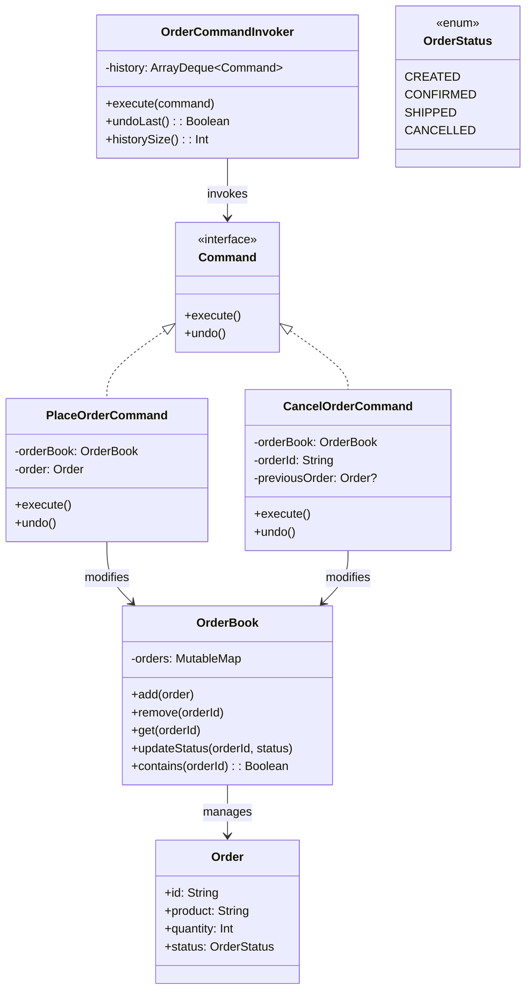

# Command

## Définition

Le pattern Command encapsule une requête sous forme d'objet, ce qui permet de paramétrer des clients avec différentes requêtes, de mettre des requêtes en file d'attente, de les logger, et de supporter l'annulation. Il sépare l'émetteur de la requête de son exécuteur.

## Problème

Un système de gestion de commandes e-commerce doit permettre de placer et annuler des commandes, avec la possibilité de défaire chaque opération. Sans le pattern Command, la logique d'exécution et d'annulation est dispersée dans le code appelant, rendant l'historique et le rollback complexes a gérer.

## Solution

Chaque action métier (placer une commande, annuler une commande) est encapsulée dans un objet `Command` avec deux méthodes : `execute()` et `undo()`.

- **`PlaceOrderCommand`** : ajoute une commande à l' `OrderBook`. L'undo la retire.
- **`CancelOrderCommand`** : retire une commande de l'`OrderBook` en sauvegardant une copie. L'undo la restaure.
- **`OrderCommandInvoker`** : l'invocateur maintient une pile d'historique (`ArrayDeque`) et offre `undoLast()` pour défaire la dernière action.

Le **receiver** (`OrderBook`) contient les opérations de bas niveau, tandis que les commandes orchestrent la logique.

## Quand l'utiliser

- On a besoin de fonctionnalités undo/redo.
- On veut découpler l'émetteur d'une action de son exécuteur.
- On veut logger, mettre en file d'attente ou différer des opérations.
- On souhaite composer des macro-commandes (séquences d'opérations atomiques).

## Quand éviter

- Les opérations sont simples et n'ont pas besoin d'undo : un appel de méthode direct suffit.
- Le nombre de commandes est très élevé et chacune porte peu de logique : l'overhead en classes est disproportionné.
- L'état du receiver est trop complexe a capturer pour un undo fiable.

## Schéma

Commande pour exécuter :
`./gradlew :patterns:behavioral:command:test`

## Trade-offs

| Avantages                     | Inconvénients |
|-------------------------------|---|
| Undo/redo natif               | Nombre de classes plus élevé |
| Découplage émetteur/exécuteur | Complexité de capture d'état pour l'undo |
| Historique et log             | Mémoire consommée par l'historique |
| Composable en macro-commandes | Overhead pour les opérations triviales |

## À retenir

1. Le Command transforme une action en objet : on peut la **stocker, rejouer, annuler, mettre en file d'attente ou logger**.
2. Il découple totalement le **déclencheur** (bouton, API, scheduler) de l'**exécution** : l'invoker ne sait rien de ce qu'il exécute.
3. L'undo/redo devient naturel : chaque commande sait comment s'inverser, l'historique n'est qu'une pile d'objets.
4. Le pattern est la base des systèmes transactionnels, des éditeurs, des macro-commandes et de l'event sourcing.
5. Il permet de composer des commandes (macros, batches) sans que l'invoker ne change : la complexité reste dans les commandes.
