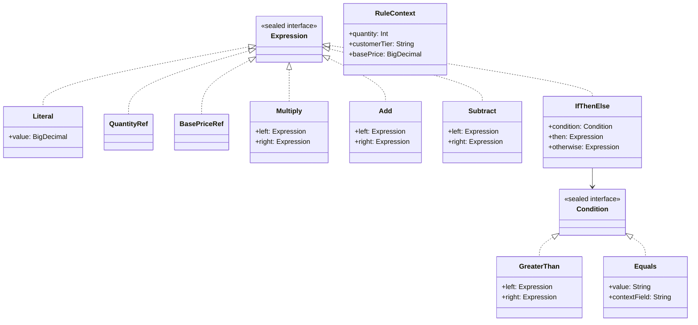

# Interpreter

## Définition

L'Interpreter définit une grammaire pour un langage simple et fournit un interpréteur capable d'évaluer des expressions de ce langage. Chaque règle grammaticale est représentée par une classe, et l'arbre syntaxique (AST) est évalué récursivement.

## Problème

Un système de pricing doit appliquer des règles tarifaires complexes et configurables : "si la quantité dépasse 10, appliquer 15% de remise sur le prix de base multiplié par la quantité". Ces règles changent fréquemment et varient par segment client. Les coder en dur dans le code métier est inflexible : chaque changement nécessite une recompilation.

## Solution

On modélise les règles tarifaires comme un mini-langage avec un AST composé de :
- **Expressions** (`sealed interface Expression`) : `Literal`, `QuantityRef`, `BasePriceRef`, `Multiply`, `Add`, `Subtract`, `IfThenElse`
- **Conditions** (`sealed interface Condition`) : `GreaterThan`, `Equals`
- **Contexte** (`RuleContext`) : fournit les données d'exécution (quantité, tier client, prix de base)

Les fonctions `evaluate()` et `evaluateCondition()` parcourent l'AST récursivement et produisent un `BigDecimal` ou un `Boolean`.

## Quand l'utiliser

- Quand un domaine a un langage de règles simple et récurrent (pricing, validation, routing)
- Quand les règles doivent être modifiables sans recompilation
- Quand la grammaire est simple (< 15 règles) et l'AST peu profond
- Quand on veut pouvoir composer des règles de manière déclarative

## Quand éviter

- Quand la grammaire est complexe : l'Interpreter devient un compilateur artisanal peu maintenable
- Quand la performance est critique : l'évaluation récursive d'un AST est plus lente qu'un code compilé
- Quand un moteur de règles existant (Drools, JEXL) couvre le besoin
- Quand les règles ne changent jamais : du code Kotlin direct est plus lisible

## Schéma

Commande pour exécuter :
`./gradlew :patterns:behavioral:interpreter:test`

## Trade-offs

| Avantages | Inconvénients |
|-----------|---------------|
| Règles déclaratives et composables | Performance O(n) par noeud, pas optimisé |
| AST immutable, facile à sérialiser/persister | Grammaire complexe = explosion de classes |
| `sealed interface` + `when` = exhaustivité compilée | Pas de messages d'erreur utilisateur (pas de parser) |
| Séparation structure / évaluation | Ajouter un type de noeud modifie `evaluate()` |

## À retenir

1. L'Interpreter permet de définir un **mini-langage métier** dont les règles sont composables, stockables et modifiables sans recompiler.
2. Séparer la structure (AST) de l'évaluation permet d'**ajouter de nouveaux interpréteurs** (calcul, affichage, validation) sans modifier l'arbre.
3. Les règles deviennent des **données** : on peut les stocker en base, les charger depuis une configuration, ou les construire dynamiquement via une UI.
4. Le pattern est adapté aux grammaires **simples** (< 15 règles) -> au-delà, envisager un vrai parser ou un moteur de règles.
5. L'AST immutable est naturellement sérialisable, testable unitairement et composable par l'opérateur.
