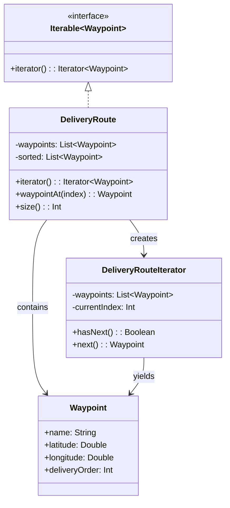

# Iterator

## Définition

Le pattern Iterator fournit un moyen d'accéder séquentiellement aux éléments d'une collection sans exposer sa représentation interne. Il découple l'algorithme de parcours de la structure de données sous-jacente.

## Problème

Un système de logistique gère des routes de livraison composées de points de parcours(waypoints) (entrepôt, clients, dépôt de retour). Les waypoints peuvent être ajoutés dans un ordre quelconque, mais le parcours doit toujours se faire dans l'ordre de livraison (`deliveryOrder`). Exposer la liste interne et forcer le client a trier violerait l'encapsulation et dupliquerait la logique de tri.

## Solution

La classe `DeliveryRoute` implémente `Iterable<Waypoint>` et fournit un `DeliveryRouteIterator` qui parcourt les waypoints triés par `deliveryOrder`. Le client utilise un simple `for (waypoint in route)` sans connaître la structure interne.

Composants :
- **`Waypoint`** : data class avec nom, coordonnées GPS et ordre de livraison.
- **`DeliveryRoute`** : collection qui trie ses waypoints et expose un itérateur.
- **`DeliveryRouteIterator`** : itérateur concret avec `hasNext()` / `next()`.
- **Extensions** : `pending()` pour les stops restants, `totalStops` pour le nombre total.

## Quand l'utiliser

- On veut parcourir une collection sans exposer son implémentation interne.
- Plusieurs algorithmes de parcours sont possibles (par ordre, par priorité, filtré).
- On souhaite offrir une API uniforme (`for-in`) sur des structures de données variées.
- On veut que la collection puisse changer sa structure interne sans casser le code client.

## Quand éviter

- La collection est un simple `List` ou `Set` standard : Kotlin le supporte déja nativement.
- Le parcours est trivial et ne nécessite aucune logique métier spécifique.
- On a besoin d'un accès aléatoire plutôt que séquentiel.

## Schéma

Commande pour exécuter :
`./gradlew :patterns:behavioral:iterator:test`

## Trade-offs

| Avantages | Inconvénients |
|---|---|
| Encapsulation de la structure interne | Classe supplémentaire pour l'itérateur |
| API uniforme via `for-in` | Parcours séquentiel uniquement (pas d'accès aléatoire) |
| Compatible avec tout l'écosystème Kotlin collections | Overhead pour des collections triviales |
| Logique de tri invisible pour le client | L'itérateur est a usage unique (pas de reset) |

## À retenir

1. L'Iterator offre un **accès uniforme** aux éléments d'une collection, quelle que soit sa structure interne (liste, arbre, graphe, base de données).
2. Il **encapsule la logique de parcours** (tri, filtrage, pagination) : le client ne voit que des éléments dans le bon ordre.
3. Le pattern permet de parcourir une structure **sans en exposer la représentation interne** -> séparation des responsabilités.
4. Plusieurs itérateurs indépendants peuvent parcourir la même structure simultanément, chacun avec son propre état.
5. En Kotlin, implémenter `Iterable<T>` donne accès à tout l'écosystème (`for-in`, `map`, `filter`, `toList`).
