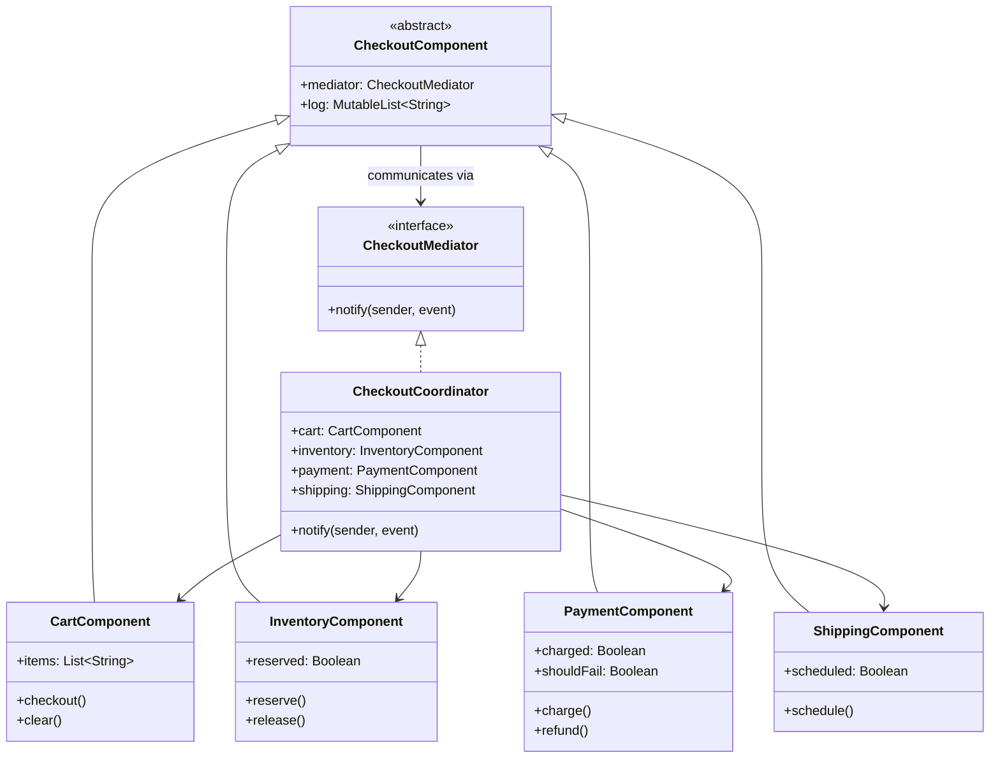

# Mediator

## Définition

Le pattern Mediator définit un objet qui encapsule la façon dont un ensemble d'objets interagissent. Il favorise un couplage faible en empêchant les objets de se référer directement les uns aux autres, et permet de varier leurs interactions indépendamment.

## Problème

Un processus de checkout e-commerce implique plusieurs composants qui doivent se coordonner : le panier, l'inventaire, le paiement et l'expédition. Si chaque composant communique directement avec les autres, on obtient un graphe de dépendances complexe (N*(N-1) relations) qui rend le système fragile et difficile a modifier.

## Solution

Un **`CheckoutCoordinator`** (le médiateur concret) centralise toute la logique d'orchestration. Chaque composant ne connaît que le médiateur et communique via `mediator.notify(sender, event)`.

Flux du checkout réussi :
1. `CartComponent.checkout()` notifie le médiateur avec l'événement `"checkout"`.
2. Le médiateur réserve l'inventaire, lance le paiement, planifie l'expédition et vide le panier.

Flux en cas d'échec de paiement :
1. `PaymentComponent.charge()` échoue et notifie `"payment_failed"`.
2. Le médiateur libère l'inventaire. Le panier et l'expédition ne sont pas touchés.

## Quand l'utiliser

- Plusieurs objets communiquent de manière complexe et les dépendances mutuelles sont difficiles a gérer.
- On veut centraliser la logique d'orchestration en un seul point.
- On souhaite pouvoir remplacer la stratégie de coordination sans modifier les composants.
- Les composants doivent être réutilisables indépendamment.

## Quand éviter

- Seulement 2-3 objets interagissent de manière simple : un appel direct est plus clair.
- Le médiateur risque de devenir un "God Object" qui concentre trop de logique.
- Les interactions sont purement event-driven sans orchestration : un Event Bus est plus adapté.

## Schéma

Commande pour exécuter :
`./gradlew :patterns:behavioral:mediator:test`

## Trade-offs

| Avantages | Inconvénients |
|---|---|
| Découplage total entre composants | Risque de "God Object" si le médiateur grossit |
| Logique de coordination centralisée | Indirection supplémentaire pour les cas simples |
| Composants réutilisables indépendamment | Le médiateur connaît tous les composants |
| Facilite les tests unitaires par composant | Complexité de setup (initialisation circulaire) |

## À retenir

1. Le Mediator remplace un graphe de dépendances **N x N** entre composants par une étoile centralisée -- la complexité relationnelle chute drastiquement.
2. Chaque composant devient **réutilisable** dans un autre contexte : il ne connaît que le médiateur, pas ses pairs.
3. Les règles d'orchestration sont regroupées en un seul endroit au lieu d'être dispersées dans chaque composant.
4. Le pattern est idéal pour les workflows multi-étapes : checkout, wizard, formulaire, pipeline de validation.
5. Attention au piège du God Object : si le médiateur grossit, le découper en sous-médiateurs spécialisés.
