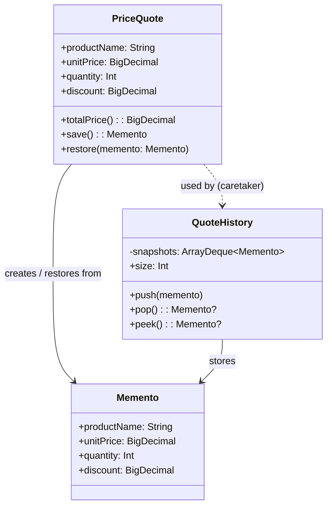

# Memento

## Définition

Le pattern Memento permet de capturer et de restaurer l'état interne d'un objet sans violer son encapsulation. Il offre un mécanisme d'undo en sauvegardant des snapshots (mementos) de l'état a différents moments.

## Problème

Un commercial prépare un devis (price quote) pour un client : il ajuste le produit, la quantité, le prix unitaire et la remise au fil de la négociation. Il doit pouvoir revenir en arrière a tout moment si le client change d'avis. Sans mécanisme d'undo, chaque modification est irréversible, ou bien il faut exposer tous les champs internes pour les sauvegarder manuellement.

## Solution

Trois rôles collaborent :

- **Originator (`PriceQuote`)** : l'objet métier mutable dont on veut capturer l'état. Il expose `save()` pour créer un memento et `restore()` pour revenir a un état précédent.
- **Memento (`PriceQuote.Memento`)** : snapshot immutable de l'état du devis (produit, prix, quantité, remise). Implémenté comme une `data class` imbriquée.
- **Caretaker (`QuoteHistory`)** : pile LIFO qui stocke les mementos sans jamais inspecter leur contenu.

Le commercial sauvegarde avant chaque modification et peut annuler en dépilant le dernier memento.

## Quand l'utiliser

- On a besoin d'un mécanisme d'undo/redo.
- On veut sauvegarder l'état sans exposer les détails internes de l'objet.
- L'état a capturer est relativement compact (quelques champs).
- On veut pouvoir comparer des snapshots (historique de versions).

## Quand éviter

- L'état de l'objet est très volumineux : chaque snapshot consomme beaucoup de mémoire.
- L'objet a des références profondes (graphe d'objets) : le clonage profond est coûteux et risqué.
- Un simple undo par "inverse de la dernière opération" (pattern Command) suffit.
- L'état change trop fréquemment : la pile de mementos grossit rapidement.

## Schéma

Commande pour exécuter :
`./gradlew :patterns:behavioral:memento:test`

## Trade-offs

| Avantages | Inconvénients |
|---|---|
| Undo sans violer l'encapsulation | Consommation mémoire proportionnelle au nombre de snapshots |
| Snapshots comparables (data class) | Clonage profond nécessaire pour les objets complexes |
| Historique complet des versions | Le caretaker doit gérer le cycle de vie des mementos |
| API save/restore simple | Pas de redo natif (a implémenter en plus) |

## À retenir

1. Le Memento permet l'**undo/redo** et le **versioning** sans violer l'encapsulation : l'état est capturé sans exposer les détails internes.
2. Le caretaker gère les snapshots sans en connaître le contenu -> la séparation des responsabilités est totale.
3. Le pattern rend l'historique d'un objet **navigable** : revenir à un état antérieur est une opération simple et sûre.
4. Bien distinguer Memento (snapshot d'**état**) et Command (snapshot d'**opération**) : les deux supportent l'undo mais par des approches différentes.
5. Le pattern est la base des systèmes d'historique : éditeurs de texte, formulaires, wizards, transactions annulables.
