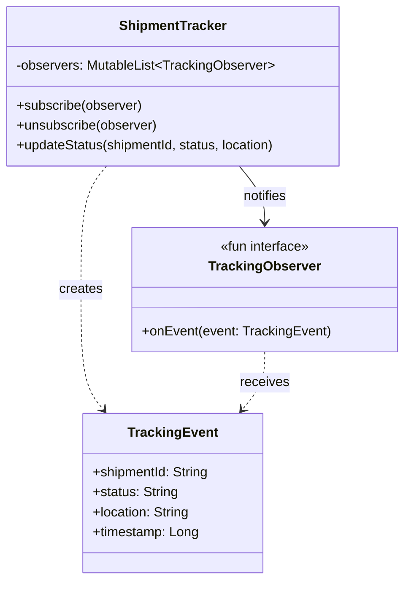

# Observer

## Définition

Le pattern Observer définit une relation one-to-many entre objets : lorsqu'un sujet (subject) change d'état, tous ses observateurs (observers) sont notifiés automatiquement. Cela permet un découplage fort entre le producteur d'événements et ses consommateurs.

## Problème

Un système de suivi de colis (shipment tracking) doit notifier plusieurs services en temps réel lorsqu'un colis change de statut : notification client par email, mise a jour du dashboard interne, alimentation d'un système d'analytics. Coupler directement le tracker a chaque consommateur crée un code rigide et difficile a étendre.

## Solution

Le `ShipmentTracker` joue le rôle de **subject** observable. Il maintient une liste de `TrackingObserver` et les notifie a chaque mise a jour de statut via un `TrackingEvent` immutable contenant l'identifiant du colis, le statut, la localisation et un timestamp.

Les observers s'abonnent (`subscribe`) et se désabonnent (`unsubscribe`) dynamiquement, sans que le tracker ait connaissance de leur implémentation concrète.

## Quand l'utiliser

- Plusieurs composants doivent réagir a un même événement sans se connaître mutuellement.
- Le nombre et la nature des observateurs peuvent varier a l'exécution.
- On souhaite un couplage faible entre le producteur et les consommateurs d'événements.
- Le pattern est un socle pour les architectures event-driven.

## Quand éviter

- Un seul consommateur existe et n'évoluera pas : un appel direct est plus simple.
- L'ordre de notification est critique et garanti : le pattern ne le promet pas par défaut.
- Les observateurs doivent répondre de manière synchrone avec un résultat : préférer un pattern Mediator ou Chain of Responsibility.

## Schéma

Commande pour exécuter :
`./gradlew :patterns:behavioral:observer:test`

## Trade-offs

| Avantages | Inconvénients |
|---|---|
| Découplage fort producteur/consommateurs | Notifications non ordonnées par défaut |
| Ajout d'observers sans modifier le subject | Risque de fuites mémoire si désabonnement oublié |
| Extensible a l'exécution | Difficulté de debug (qui écoute ?) |
| Base pour event-driven architecture | La propagation synchrone peut bloquer |

## À retenir

1. L'Observer permet à un objet de **notifier automatiquement** tous ses dépendants d'un changement, sans les connaître.
2. Le sujet et les observateurs évoluent **indépendamment** : ajouter un nouveau consommateur ne modifie pas le producteur.
3. Le pattern est le fondement de toute architecture **event-driven** : UI réactives, systèmes de notification, monitoring.
4. Le désabonnement est aussi important que l'abonnement.
5. Les événements immutables garantissent que les observers ne peuvent pas altérer les données partagées entre eux.
