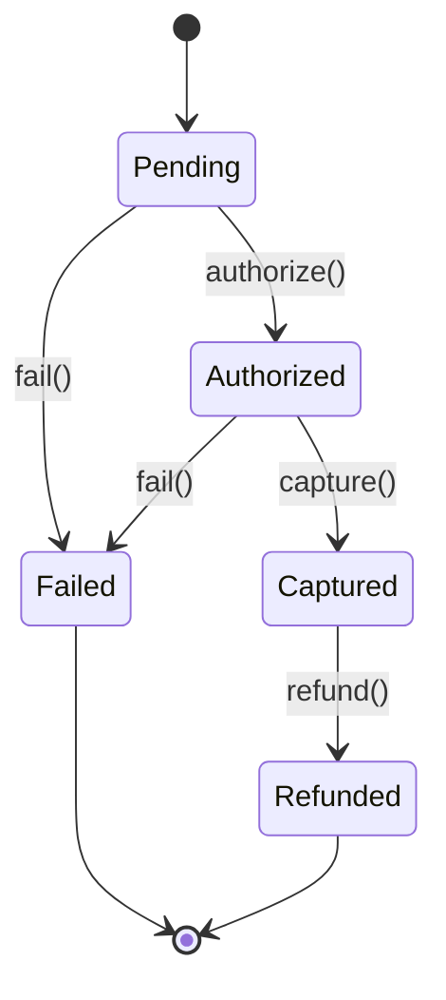

# State

## Définition

Le pattern State permet a un objet de modifier son comportement lorsque son état interne change. L'objet semble changer de classe. Il remplace les conditionnelles complexes par un ensemble d'états encapsulés dans des classes distinctes.

## Problème

Un système de paiement e-commerce doit gérer le cycle de vie d'un paiement : en attente, autorisé, capturé, remboursé ou échoué. Chaque transition n'est valide que depuis certains états. Sans le pattern State, le code devient un enchaînement de `if/when` fragile, ou chaque nouvelle transition risque de casser les règles existantes.

## Solution

Les états du paiement sont modélisés comme une **hiérarchie sealed** (`PaymentState`), et un `PaymentProcessor` applique la machine a états en vérifiant les préconditions avant chaque transition.

Machine a états :
- `Pending` -> `Authorized` (authorize)
- `Pending` -> `Failed` (fail)
- `Authorized` -> `Captured` (capture)
- `Authorized` -> `Failed` (fail)
- `Captured` -> `Refunded` (refund)

Toute transition invalide lève une `IllegalStateException` explicite.

## Quand l'utiliser

- Un objet a un nombre fini d'états avec des transitions bien définies.
- Le comportement change selon l'état courant.
- On veut remplacer des `if/when` imbriqués par des classes d'état explicites.
- On souhaite rendre les transitions testables et documentées.

## Quand éviter

- L'objet n'a que 2-3 états avec des transitions triviales : un simple `enum` + `when` suffit.
- Les états sont dynamiques ou non bornés : le pattern devient rigide.
- Les transitions dépendent de multiples objets simultanément : un Mediator est plus adapté.

## Schéma

Commande pour exécuter :
`./gradlew :patterns:behavioral:state:test`

## Trade-offs

| Avantages | Inconvénients |
|---|---|
| Exhaustivité garantie par le compilateur | Plus de classes que des enums simples |
| Transitions explicites et documentées | La logique de transition est dans le Processor, pas dans les états eux-mêmes |
| Messages d'erreur riches | Mutations via `var state` |
| Testabilité des transitions individuelles | Nécessité de connaître le diagramme d'états complet |

## À retenir

1. Le pattern State **élimine les blocs `if/when` géants** : chaque état porte son propre comportement et ses propres transitions.
2. Ajouter un nouvel état n'impacte pas les états existants -> le code est ouvert à l'extension (Open/Closed Principle).
3. Les transitions invalides échouent **explicitement** (fail-fast) au lieu de produire des comportements silencieux et imprévisibles.
4. La machine à états rend le cycle de vie d'un objet **visible et documenté** : on voit d'un coup d'oeil tous les états et transitions possibles.
5. Le pattern est naturel pour les workflows métier : paiement, commande, approbation, cycle de vie d'un ticket.
