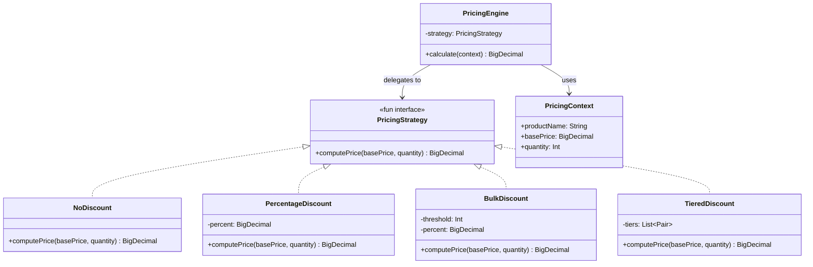

# Strategy

## Définition

Le pattern Strategy définit une famille d'algorithmes interchangeables, les encapsule chacun dans une classe distincte, et permet au client de choisir lequel utiliser a l'exécution. L'algorithme varie indépendamment du code qui l'utilise.

## Problème

Un moteur de pricing e-commerce doit appliquer différentes politiques de remise selon le contexte : pas de remise, remise en pourcentage, remise de volume (bulk), ou remises par palier (tiered). Ajouter un `if/else` ou un `when` géant dans le code de calcul viole le principe Open/Closed et rend chaque nouvelle règle de prix coûteuse a intégrer.

## Solution

On extrait chaque algorithme de calcul de prix dans une classe dédiée implémentant l'interface `PricingStrategy`. Le `PricingEngine` délègue le calcul a la stratégie courante, que l'on peut permuter a chaud (ex. promotion Black Friday).

Les stratégies concrètes :
- **NoDiscount** : prix brut sans remise.
- **PercentageDiscount** : remise en pourcentage fixe.
- **BulkDiscount** : remise conditionnelle au volume (seuil minimum).
- **TieredDiscount** : paliers de remise progressifs.

## Quand l'utiliser

- Plusieurs algorithmes coexistent pour un même comportement et doivent être interchangeables.
- On veut pouvoir changer d'algorithme a l'exécution (A/B testing, promotions temporaires).
- On veut isoler la logique métier de chaque variante pour la tester indépendamment.
- On souhaite respecter le principe Open/Closed : ajouter une stratégie sans modifier le code existant.

## Quand éviter

- Un seul algorithme existe et n'évoluera vraisemblablement pas : une simple fonction suffit.
- Le nombre de stratégies est très faible et le code client est trivial : l'indirection ajoutée nuit a la lisibilité.
- Les stratégies ont besoin d'un accès a l'état interne du contexte : le couplage indirect devient fragile.

## Schéma

Commande pour exécuter :
`./gradlew :patterns:behavioral:strategy:test`

## Trade-offs

| Avantages | Inconvénients |
|---|---|
| Respect du principe Open/Closed | Augmente le nombre de classes |
| Stratégies testables isolément | Le client doit connaître les stratégies disponibles |
| Swap a chaud sans redéploiement | Indirection supplémentaire pour les cas simples |
| Compose bien avec l'injection de dépendances | Overhead si une seule stratégie existe |

## À retenir

1. Le pattern Strategy permet de **changer d'algorithme au runtime** sans modifier le contexte qui l'utilise -> idéal pour les règles métier configurables.
2. Chaque stratégie est **testable isolément** : on valide une règle de pricing, un tri ou un calcul sans monter tout le système.
3. Le contexte (engine, service) reste **stable** même quand les algorithmes changent, évoluent ou se multiplient.
4. Le pattern élimine les conditionnels (`if/when`) qui sélectionnent un comportement -> chaque branche devient une classe.
5. En Kotlin, `fun interface` rend le pattern quasi transparent : une lambda suffit pour les cas simples.
