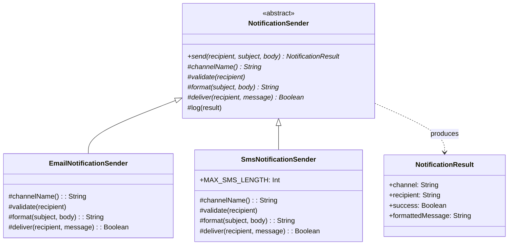

# Template Method

## Définition

Le pattern Template Method définit le squelette d'un algorithme dans une méthode de la classe parente, en déléguant certaines étapes a des sous-classes. Les sous-classes redéfinissent des étapes spécifiques sans modifier la structure globale de l'algorithme.

## Problème

Un système de notifications doit envoyer des messages via différents canaux (email, SMS) en suivant toujours le même processus : valider le destinataire, formater le message, le livrer, puis logger le résultat. Chaque canal a ses propres règles de validation et de formatage, mais le flux global est identique. Dupliquer ce flux dans chaque implémentation mène a des incohérences et viole le principe DRY.

## Solution

La classe abstraite `NotificationSender` définit le flux dans la méthode `send()` (la template method) :
1. `validate(recipient)` -- vérifier le format du destinataire.
2. `format(subject, body)` -- formater le message selon le canal.
3. `deliver(recipient, message)` -- envoyer le message.
4. `log(result)` -- logger (hook optionnel, no-op par défaut).

Deux implémentations concrètes :
- **`EmailNotificationSender`** : valide l'adresse email par regex, formate en HTML.
- **`SmsNotificationSender`** : valide le numéro de téléphone (préfixe `+`), tronque le message a 160 caractères.

## Quand l'utiliser

- Plusieurs variantes d'un algorithme partagent la même structure.
- On veut figer le flux global tout en laissant les détails d'implémentation aux sous-classes.
- On souhaite éviter la duplication du squelette algorithmique.
- On a besoin de hooks optionnels (étapes que les sous-classes peuvent surcharger ou ignorer).

## Quand éviter

- Le nombre d'étapes personnalisables est trop élevé : l'héritage devient fragile.
- Les variantes ne partagent presque rien : le pattern force une structure artificielle.
- On préfère la composition a l'héritage : le pattern Strategy est une alternative plus flexible.

## Schéma

Commande pour exécuter :
`./gradlew :patterns:behavioral:template-method:test`

## Trade-offs

| Avantages | Inconvénients |
|---|---|
| Élimine la duplication du flux | Héritage = couplage fort avec la classe parente |
| Flux garanti et invariant | Difficulté a combiner des étapes de différentes hiérarchies |
| Hooks optionnels pour la personnalisation | Le nombre d'étapes abstraites peut exploser |
| Testable via un spy/mock | Moins flexible que Strategy (composition) |

## À retenir

1. La Template Method garantit que le **squelette d'un algorithme** est respecté, tout en laissant les sous-classes personnaliser les étapes.
2. Elle applique le principe **"Don't call us, we'll call you"** (Hollywood Principle) : l'inversion de contrôle au coeur du framework design.
3. Le pattern élimine la duplication du flux commun : la séquence d'étapes est définie une seule fois dans la classe parente.
4. Les hooks offrent des points d'extension **optionnels** sans forcer chaque sous-classe à tout implémenter.
5. Si la flexibilité prime sur la structure imposée, préférer le Strategy (composition) au Template Method (héritage).
