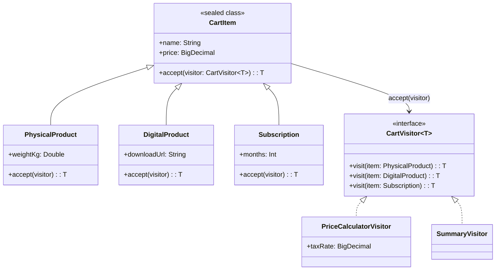

# Visitor

## Définition

Le Visitor permet de définir de nouvelles opérations sur une hiérarchie d'objets sans modifier les classes existantes. Chaque opération est encapsulée dans un visiteur séparé, et le double dispatch (`accept`/`visit`) garantit l'appel de la bonne surcharge.

## Problème

Un panier e-commerce contient différents types d'articles : produits physiques (avec poids et frais de port), produits digitaux (avec URL de téléchargement) et abonnements (avec durée en mois). On doit pouvoir calculer le prix total, générer un résumé textuel, compter les mois d'abonnement, etc. Ajouter chaque opération directement dans les classes d'articles viole l'Open/Closed Principle : chaque nouvelle opération modifie toute la hiérarchie.

## Solution

On définit une `sealed class CartItem` avec trois variantes (`PhysicalProduct`, `DigitalProduct`, `Subscription`), chacune exposant une méthode `accept(visitor)`. L'interface `CartVisitor<T>` déclare une surcharge `visit()` par variante. Chaque opération (calcul de prix, résumé, comptage) est un visiteur concret indépendant.

Le double dispatch fonctionne ainsi : `item.accept(visitor)` appelle `visitor.visit(this)` dans la sous-classe concrète, garantissant la résolution au bon type sans cast.

## Quand l'utiliser

- Quand la hiérarchie d'objets est **stable** mais les opérations changent fréquemment
- Quand plusieurs opérations distinctes doivent traverser la même structure (prix, résumé, export, validation)
- Quand on veut éviter de polluer les classes métier avec des responsabilités transversales
- Quand le double dispatch est nécessaire pour résoudre le type concret à l'exécution

## Quand éviter

- Quand la hiérarchie change souvent : ajouter un nouveau type oblige à modifier **tous** les visiteurs
- Quand il n'y a qu'une ou deux opérations : un simple `when` sur `sealed class` suffit en Kotlin
- Quand les opérations sont simples et ne justifient pas l'indirection du double dispatch
- Quand l'encapsulation est critique : le visiteur accède aux données internes des éléments

## Schéma

Commande pour exécuter :
`./gradlew :patterns:behavioral:visitor:test`

## Trade-offs

| Avantages | Inconvénients |
|-----------|---------------|
| Nouvelle opération = nouveau visiteur, sans toucher les éléments | Nouveau type d'élément = modifier tous les visiteurs |
| Chaque visiteur a une responsabilité unique (SRP) | Double dispatch ajoute de l'indirection |
| Le générique `<T>` rend le type de retour explicite | Le visiteur accède aux données internes (couplage) |
| `sealed class` sécurise l'exhaustivité | En Kotlin, `when` sur sealed class est souvent plus simple |

## À retenir

1. Le Visitor permet d'**ajouter de nouvelles opérations** sur une structure sans modifier ses classes -> idéal quand les types sont stables mais les traitements évoluent.
2. Chaque opération (calcul total, formatage, validation) est regroupée dans un seul visiteur au lieu d'être dispersée dans chaque classe.
3. Le double dispatch résout le type concret **sans cast ni `instanceof`** : le polymorphisme fait le travail.
4. Le trade-off est clair : ajouter un nouveau type oblige à modifier **tous** les visiteurs -> le pattern favorise l'extensibilité des opérations, pas des types.
5. En Kotlin, `sealed class` + `when` exhaustif offrent une alternative idiomatique quand les opérations restent peu nombreuses.