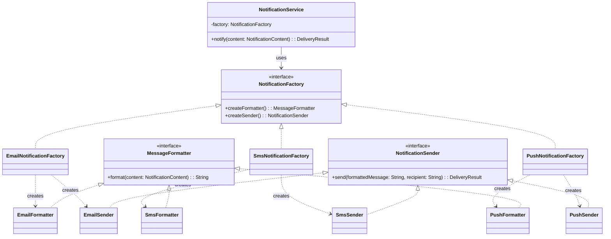

# Abstract Factory

## Définition

L'Abstract Factory fournit une interface pour créer des familles d'objets liés sans spécifier leurs classes concrètes. Contrairement au Factory Method qui crée un seul type d'objet, l'Abstract Factory crée un ensemble cohérent d'objets qui fonctionnent ensemble.

## Problème

Un système de notifications e-commerce doit envoyer des messages par différents canaux (email, SMS, push). Chaque canal nécessite un formatage spécifique (headers SMTP pour l'email, troncature à 160 caractères pour le SMS, JSON pour le push) et un mécanisme d'envoi distinct. Le service de notification ne devrait pas connaître les détails de chaque canal : il doit simplement formater et envoyer.

## Solution

On définit une interface `NotificationFactory` qui produit deux objets liés : un `MessageFormatter` et un `NotificationSender`. Chaque canal (Email, SMS, Push) a sa propre factory concrète qui garantit la cohérence entre le formatter et le sender. Le `NotificationService` reçoit une factory par injection et orchestre le flux sans connaître le canal concret.

La famille d'objets (formatter + sender) est toujours cohérente : un `EmailFormatter` est toujours associé à un `EmailSender`, jamais à un `SmsSender`.

## Quand l'utiliser

- Quand un système doit créer des familles d'objets interdépendants (formatter + sender, widget + layout, DAO + connection)
- Quand la cohérence entre les objets d'une même famille est critique
- Quand on veut pouvoir changer de famille entière à l'exécution (passer d'email à SMS en changeant une seule factory)
- Quand le nombre de canaux/variantes va croître et que chaque canal a ses propres règles

## Quand éviter

- Quand les objets créés ne sont pas réellement liés entre eux (un simple Factory Method suffit)
- Quand il n'y a qu'un seul produit à créer par famille
- Quand l'ajout d'un nouveau type de produit dans la famille nécessite de modifier toutes les factories existantes
- Quand la combinatoire familles x produits explose sans réelle valeur ajoutée

## Schéma

Commande pour exécuter :
`./gradlew :patterns:creational:abstract-factory:test`

## Trade-offs

| Avantages | Inconvénients |
|-----------|---------------|
| Cohérence garantie au sein d'une famille | Nombre de classes élevé (2 produits x 3 familles = 6 classes + 3 factories) |
| Le client (`NotificationService`) est totalement découplé | Ajouter un nouveau produit à la famille (ex: `TemplateEngine`) impacte toutes les factories |
| Changement de canal = changement d'une seule factory | Peut sembler over-engineered pour 2 produits simples |
| Chaque famille encapsule ses propres règles métier |  |

## À retenir

1. L'Abstract Factory garantit la **cohérence** d'une famille d'objets : impossible de mélanger des produits incompatibles.
2. Changer de famille entière (ex: SMS → Email) revient à injecter une autre factory -> **une seule ligne** modifie tout le comportement.
3. Chaque famille encapsule ses propres règles métier tout en respectant un contrat commun : le client reste identique.
4. Le pattern brille quand de nouvelles familles apparaissent régulièrement (nouveau canal, nouveau provider, nouvelle région).
5. Différence clé avec le Factory Method : ici on crée des **groupes** cohérents d'objets, pas des objets individuels.
