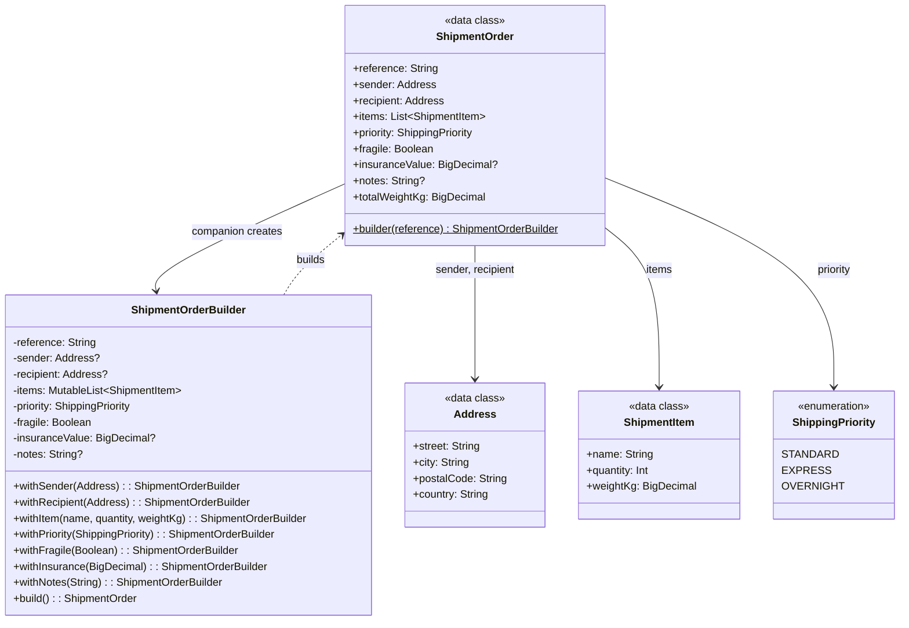

# Builder

## Définition

Le Builder sépare la construction d'un objet complexe de sa représentation, permettant de créer différentes configurations du même objet étape par étape via un chaînage de méthodes fluide (`withXXX()`).

## Problème

Un système logistique doit créer des ordres d'expédition (`ShipmentOrder`) avec de nombreux paramètres : référence, adresses expéditeur/destinataire, liste d'articles (chacun avec nom, quantité, poids), priorité, fragilité, assurance, notes. Certains champs sont obligatoires, d'autres optionnels avec des valeurs par défaut. Un constructeur classique avec 8+ paramètres serait illisible et source d'erreurs.

## Solution

On crée un `ShipmentOrderBuilder` accessible via `ShipmentOrder.builder(reference)`. Chaque méthode `withXXX()` retourne `this` (via `apply`), permettant un chaînage fluide. La méthode `build()` valide les contraintes (adresses requises) et produit un `ShipmentOrder` immutable.

```kotlin
val order = ShipmentOrder
    .builder("SHP-2024-001")
    .withSender(parisAddress)
    .withRecipient(londonAddress)
    .withItem("Laptop", quantity = 1, weightKg = BigDecimal("2.5"))
    .withPriority(ShippingPriority.EXPRESS)
    .withFragile()
    .withInsurance(BigDecimal("1500.00"))
    .build()
```

Le `ShipmentOrder` lui-même est une `data class` avec validation `init` (référence non vide, au moins un article), garantissant qu'aucune instance invalide ne peut exister.

## Quand l'utiliser

- Objets avec de nombreux paramètres, surtout quand certains sont optionnels
- Quand la construction nécessite des étapes (ajouter des items un par un)
- Quand on veut une API fluide et découvrable (autocomplétion IDE sur `.with`)
- Quand la validation doit être centralisée au moment du `build()`
- Quand le même processus de construction doit pouvoir créer différentes représentations

## Quand éviter

- Pour des objets simples avec 2-3 propriétés (un constructeur suffit)
- Quand `data class` avec paramètres nommés et valeurs par défaut couvre le besoin
- Quand la mutabilité temporaire du builder est un risque (environnement concurrent)
- Quand le builder devient aussi complexe que l'objet qu'il construit

## Schéma



Commande pour exécuter :
`./gradlew :patterns:creational:builder:test`

## Trade-offs

| Avantages | Inconvénients |
|-----------|---------------|
| Chaînage fluide, découvrable dans l'IDE | Le builder introduit un état mutable temporaire |
| Propriétés encapsulées (toutes `private`) | Plus de code que des paramètres nommés pour un objet simple |
| Objet final immutable et garanti valide | Plus verbeux qu'un simple constructeur avec paramètres nommés |
| Construction incrémentale possible | Chaque nouveau champ = nouvelle méthode `withXXX()` à ajouter |

## À retenir

1. Le Builder **guide** la construction pas à pas : l'appelant ne peut pas oublier un champ obligatoire ni créer un objet incohérent.
2. Il rend la construction d'objets complexes **lisible** -> le code se lit comme une spécification métier, pas comme une liste d'arguments.
3. La validation à la construction garantit l'invariant "tout objet qui existe est valide" -> pas de vérification a posteriori.
4. Le Builder permet de construire des représentations différentes avec le même processus de construction.
