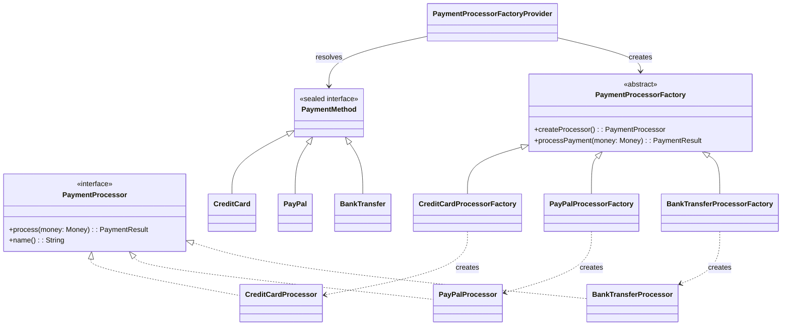

# Factory Method

## Définition

Le Factory Method définit une interface pour créer un objet, mais laisse les sous-classes décider quelle classe concrète instancier. Il permet de déléguer l'instanciation aux sous-classes, découplant ainsi le code client des implémentations concrètes.

## Problème

Un système de paiement e-commerce doit supporter plusieurs moyens de paiement (carte bancaire, PayPal, virement bancaire). Le code métier qui orchestre un paiement ne devrait pas avoir à connaître les détails d'implémentation de chaque processeur. Ajouter un nouveau moyen de paiement ne devrait pas nécessiter de modifier le code existant.

## Solution

On définit une interface `PaymentProcessor` et une classe abstraite `PaymentProcessorFactory` avec une méthode `createProcessor()`. Chaque moyen de paiement a sa propre factory concrète (`CreditCardProcessorFactory`, `PayPalProcessorFactory`, `BankTransferProcessorFactory`). Un `PaymentProcessorFactoryProvider` centralise la résolution via une `sealed interface PaymentMethod`, garantissant l'exhaustivité au compile-time.

La factory abstraite contient aussi la logique commune (`processPayment`) qui orchestre la création du processeur et l'exécution du paiement -> c'est le Template Method intégré au Factory Method.

## Quand l'utiliser

- Le type exact de l'objet à créer dépend d'un paramètre ou d'un contexte runtime
- On veut isoler la logique de création de la logique métier
- Le système doit être ouvert à l'extension (nouveau moyen de paiement) sans modification du code existant
- On souhaite centraliser la validation et la logique commune autour de la création

## Quand éviter

- Quand il n'y a qu'une seule implémentation et aucune perspective d'extension
- Quand la hiérarchie de factories devient plus complexe que le problème qu'elle résout
- Quand une simple fonction ou un `when` suffit (KISS principle)
- Si l'ajout de chaque variante nécessite deux classes (processor + factory), la verbosité peut être un signal d'alerte

## Schéma

Commande pour exécuter :
`./gradlew :patterns:creational:factory-method:test`

## Trade-offs

| Avantages | Inconvénients |
|-----------|---------------|
| Open/Closed Principle : ajouter un processeur = ajouter une factory | Prolifération de classes (1 processor + 1 factory par variante) |
| `sealed interface` garantit l'exhaustivité | Indirection supplémentaire par rapport à un simple `when` |
| Logique commune centralisée dans la factory abstraite | Peut sembler sur-ingénierie pour 2-3 variantes |
| Testable : chaque factory et processeur sont testables isolément | Le `PaymentProcessorFactoryProvider` est un quasi-Service Locator |

## À retenir

1. Le Factory Method permet d'**ajouter de nouvelles variantes** sans modifier le code client existant (Open/Closed Principle).
2. Il centralise la logique de création, évitant la duplication de `if/when` de construction à travers le codebase.
3. Le client ne dépend que de l'interface produit : il est découplé des implémentations concrètes et de leurs détails de construction.
4. La factory peut valider les invariants dès la construction, garantissant que seuls des objets valides circulent dans le système.
5. Le pattern se justifie quand le nombre de variantes **grandit** -> pour 2-3 types stables, un simple `when` suffit souvent.
