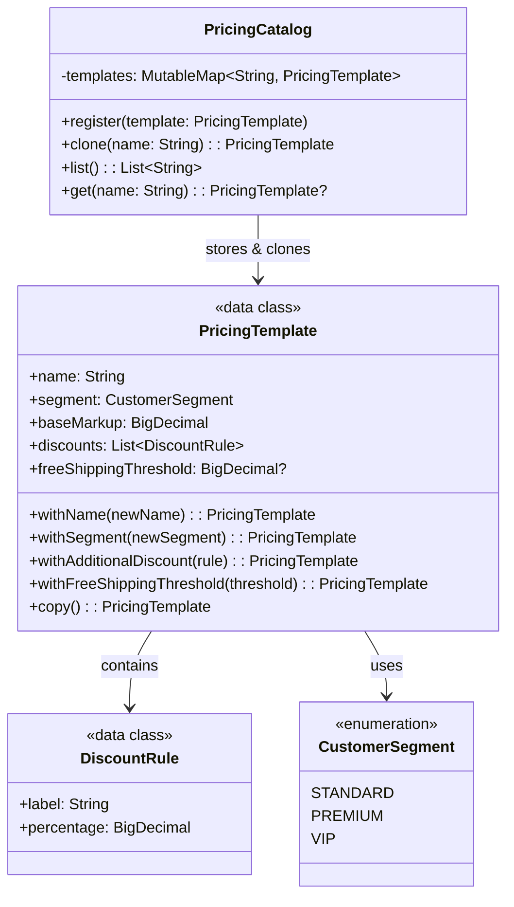

# Prototype

## Définition

Le Prototype permet de créer de nouveaux objets en copiant une instance existante (le prototype), plutôt qu'en les construisant de zéro. En Kotlin, la méthode `copy()` des `data class` rend ce pattern natif.

## Problème

Un système de pricing e-commerce gère des templates tarifaires par segment client (Standard, Premium, VIP). Créer chaque template de zéro est coûteux et source d'erreurs : les templates partagent une base commune (markup, remises de fidélité) et diffèrent sur quelques paramètres. On a besoin de pouvoir dupliquer un template existant, le personnaliser, sans affecter l'original.

## Solution

On modélise le template tarifaire avec une `data class PricingTemplate` qui expose des méthodes `withXxx()` retournant une copie modifiée (pattern immutable). Un `PricingCatalog` sert de registre de prototypes : on y enregistre des templates de référence et on les clone à la demande via `clone(name)`.

Grâce à l'immutabilité des `data class` et à `copy()`, le clone est toujours indépendant de l'original. Les listes de `DiscountRule` sont aussi immutables (`List`), donc `withAdditionalDiscount()` crée une nouvelle liste (`discounts + rule`).

## Quand l'utiliser

- Quand la création d'un objet est coûteuse ou complexe, mais qu'une copie suivie d'ajustements est simple
- Quand des objets partagent une base commune avec des variations mineures
- Quand on veut un registre de "modèles" pré-configurés que les utilisateurs peuvent personnaliser
- Quand le nombre de variantes est dynamique et ne peut pas être anticipé par des sous-classes

## Quand éviter

- Quand les objets ont des références circulaires ou des dépendances profondes difficiles à copier
- Quand la copie superficielle (shallow copy) ne suffit pas et qu'un deep copy est nécessaire
- Quand les objets sont simples à construire directement (le Prototype ajoute de la complexité inutile)
- Quand l'objet contient des ressources non copiables (connexions, fichiers ouverts)

## Schéma

Commande pour exécuter :
`./gradlew :patterns:creational:prototype:test`

## Trade-offs

| Avantages                                                 | Inconvénients                                                   |
|-----------------------------------------------------------|-----------------------------------------------------------------|
| `copy()` gratuit avec `data class` -> zéro boilerplate    | Shallow copy uniquement (suffisant ici car tout est immutable)  |
| Chaînage fluide via `withXxx()`                           | Prolifération de méthodes `withXxx()` si beaucoup de propriétés |
| Le catalogue centralise les templates de référence        | Introduit un état mutable (`MutableMap`)                        |
| Immutabilité garantie : le clone est toujours indépendant | Performance : chaque `withXxx()` crée un nouvel objet           |

## À retenir

1. Le Prototype évite de recréer from scratch : on **clone un modèle existant** et on ajuste les différences, ce qui est plus rapide et moins error-prone.
2. Un registre de prototypes permet de stocker des configurations de référence (templates, presets) et de les décliner à la demande.
3. Le clone est **indépendant** de l'original : modifier l'un ne corrompt jamais l'autre, si l'immutabilité est respectée.
4. Le pattern est particulièrement utile quand la construction est coûteuse (appels réseau, calculs complexes, chargement de ressources).
5. En Kotlin, `data class` + `copy()` rend le Prototype natif et idiomatique, sans interface `Cloneable`.
