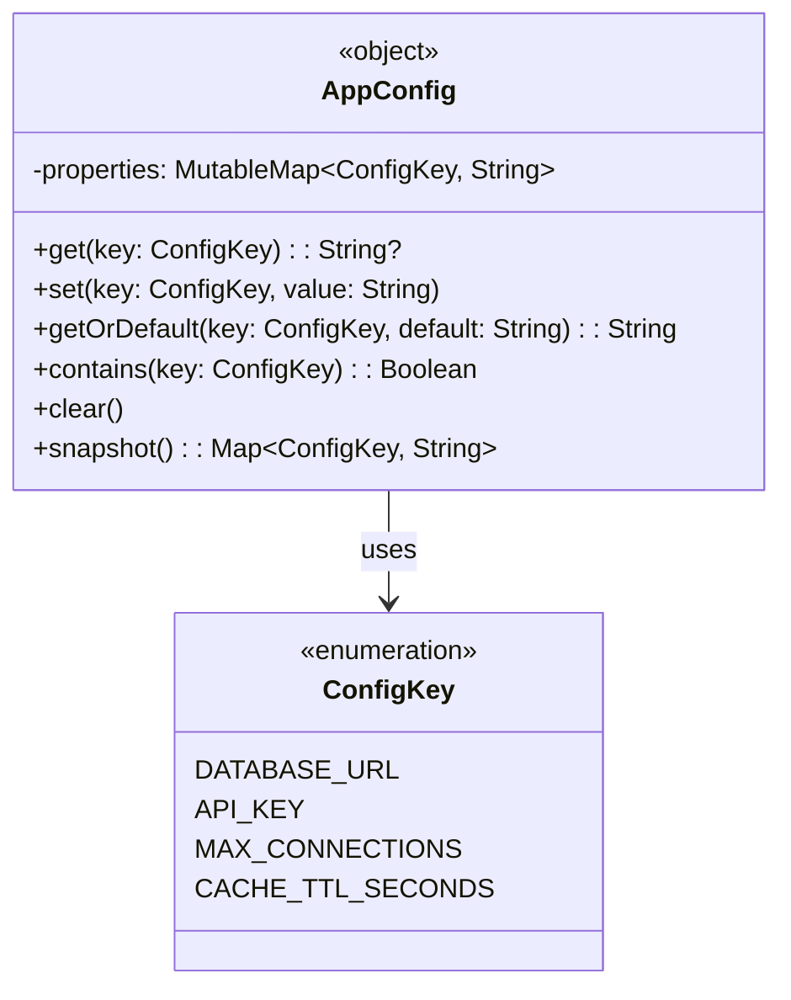

# Singleton

## Définition

Le Singleton garantit qu'une classe n'a qu'une seule instance dans toute l'application et fournit un point d'accès global à cette instance. En Kotlin, le mot-clé `object` rend ce pattern natif et thread-safe.

## Problème

Une application e-commerce a besoin d'un point centralisé pour gérer sa configuration (URL de base de données, clé API, nombre maximal de connexions, TTL du cache). Si chaque service instancie sa propre copie de la configuration, les valeurs risquent de diverger et les modifications ne seront pas visibles globalement.

## Solution

On utilise un `object` Kotlin (`AppConfig`) qui encapsule un `MutableMap<ConfigKey, String>`. Chaque service accède au même objet, lit et écrit dans le même état partagé. Une enum `ConfigKey` restreint les clés possibles pour éviter les fautes de frappe et permettre l'auto-complétion.

L'objet expose également une méthode `snapshot()` qui retourne une copie immutable de l'état courant, utile pour le logging ou le debugging sans risquer de mutation accidentelle.

## Quand l'utiliser

- Configuration globale de l'application (feature flags, URLs, timeouts)
- Cache partagé entre plusieurs composants
- Registry de services ou de plugins
- Logger centralisé
- Compteur ou métriques globales

## Quand éviter

- Quand l'état mutable global rend les tests difficiles (préférer l'injection de dépendances)
- Quand plusieurs configurations coexistent (multi-tenant, tests parallèles)
- Quand le couplage fort entre les consommateurs et le Singleton nuit à la modularité
- En environnement concurrent intensif sans synchronisation explicite (ici le `MutableMap` n'est pas thread-safe)

## Schéma

Commande pour exécuter :
`./gradlew :patterns:creational:singleton:test`

## Trade-offs

| Avantages | Inconvénients |
|-----------|---------------|
| Accès global simple et direct | Couplage fort entre les consommateurs |
| Garanti thread-safe à l'initialisation par la JVM | L'état mutable partagé peut causer des bugs subtils |
| Zéro boilerplate grâce à `object` | Difficile à mocker dans les tests unitaires |
| Enum pour les clés = sécurité au compile-time | Non adapté au multi-tenant |

## À retenir

1. Le Singleton garantit un **point d'accès unique** à une ressource partagée -> configuration, registry, cache applicatif.
2. Il élimine les incohérences causées par des instances multiples qui divergent silencieusement.
3. En Kotlin, `object` offre un Singleton thread-safe et idiomatique sans boilerplate.
4. Son principal piège est le **couplage implicite** : chaque appelant dépend d'un état global difficile à isoler en test.
5. Réserver le Singleton aux services purement techniques (config, logging, métriques) ; pour le métier, préférer l'injection de dépendances.
