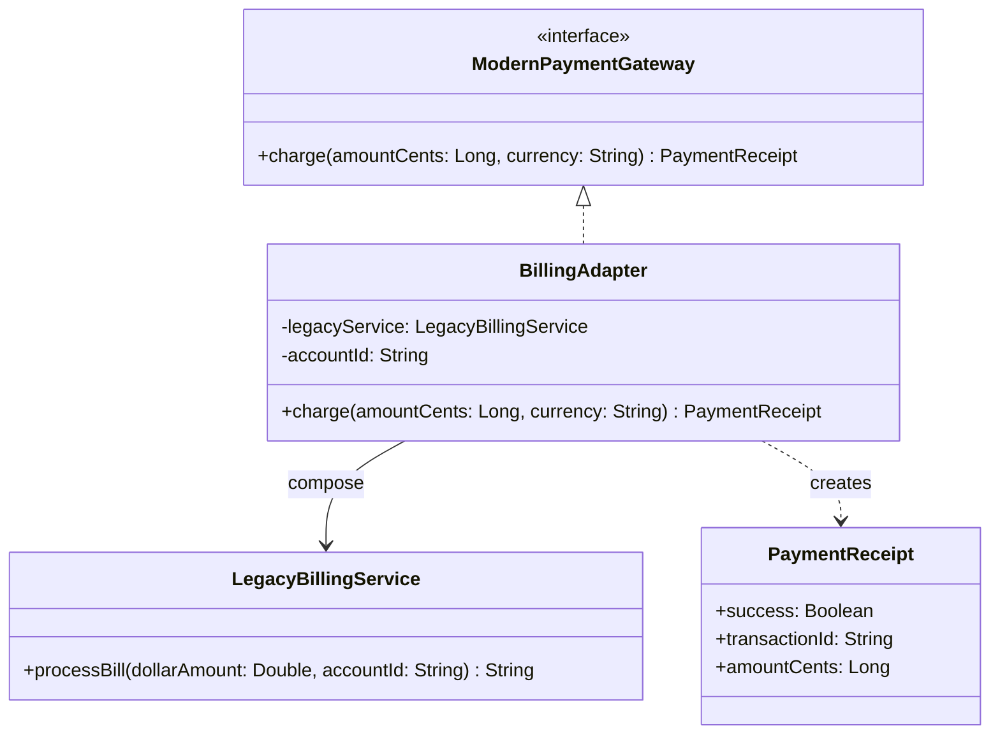

# Adapter

## Définition

L'Adapter convertit l'interface d'une classe existante en une interface attendue par les clients. Il permet a deux interfaces incompatibles de collaborer sans modifier leur code source respectif.

## Problème

Une plateforme e-commerce moderne utilise une interface de paiement unifiée (`ModernPaymentGateway`) qui travaille en **centimes** (Long) pour eviter les erreurs d'arrondi. Or, un service de facturation legacy (`LegacyBillingService`) expose une API completement differente :
- Il accepte les montants en **dollars** (Double).
- Il identifie les paiements par un `accountId` opaque.
- Il retourne un résultat sous forme de chaîne délimitée par `:` (`"OK:<txn-id>"` ou `"FAIL:<reason>"`).

Modifier le service legacy est impossible (code tiers ou dette technique). Modifier tous les clients modernes pour s'adapter au legacy serait coûteux et fragile.

## Solution

On crée un `BillingAdapter` qui :
1. Implémente `ModernPaymentGateway` (l'interface cible).
2. Encapsule une instance de `LegacyBillingService` par **composition**.
3. Traduit les appels : conversion centimes vers dollars, parsing du résultat texte en `PaymentReceipt`.

Le client ne voit que `ModernPaymentGateway` et ignore totalement l'existence du legacy.

## Quand l'utiliser

- Integration d'un service tiers dont l'API est incompatible avec votre contrat interne.
- Migration progressive : le legacy continue de fonctionner pendant que les nouveaux clients utilisent l'interface moderne.
- Réutilisation d'une classe existante dont la signature ne correspond pas a l'interface attendue.
- Besoin de découpler le code client d'une implémentation spécifique.

## Quand éviter

- Si les deux interfaces sont déja compatibles : l'adapter ajoute une indirection inutile.
- Si le legacy peut être modifié directement : un refactoring est souvent préférable a un adapter permanent.
- Si le nombre d'adapters explose : cela peut indiquer un problème d'architecture plus profond.
- Si la conversion de données est lossy (perte de précision) et que cela pose un risque métier.

## Schéma

Commande pour exécuter :
`./gradlew :patterns:structural:adapter:test`

## Trade-offs

| Avantages | Inconvénients |
|---|---|
| Respecte Open/Closed Principle : pas de modification du legacy | Indirection supplémentaire (leger coût de lisibilité) |
| Le client est totalement découplé du legacy | La conversion de données peut introduire des pertes (ex: Double vs Long) |
| Facilite les tests : on peut mocker `ModernPaymentGateway` | Un adapter par service legacy peut mener a une prolifération de classes |
| Migration progressive sans big bang | Risque de masquer un design legacy problématique au lieu de le corriger |

## À retenir

1. L'Adapter permet d'intégrer un système existant (legacy, tiers, API externe) **sans modifier ni le client ni le fournisseur**.
2. Il protège le domaine métier des changements d'infrastructure : remplacer un provider revient à écrire un nouvel adapter.
3. Le pattern transforme une incompatibilité d'interface en un problème isolé et testable, plutôt qu'en modifications dispersées dans le code.
4. L'Adapter est fin par design : il traduit et convertit, il ne contient jamais de logique métier.
5. C'est souvent le **premier pattern** à utiliser face à une intégration : simple, ciblé et à faible risque.
