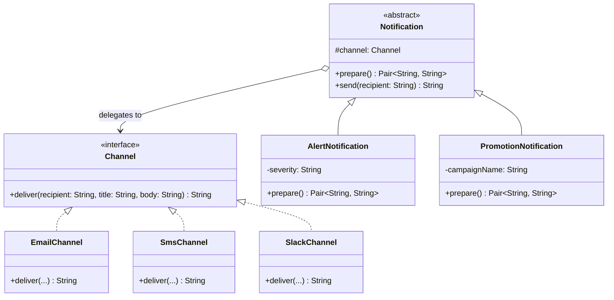

# Bridge

## Définition

Le Bridge sépare une abstraction de son implémentation afin que les deux puissent évoluer indépendamment. Il remplace l'héritage multiple par de la composition, en reliant l'abstraction a l'implémentation via une référence.

## Problème

Un système de notifications doit envoyer différents types de messages (alertes urgentes, promotions marketing) via différents canaux (email, SMS, Slack). Sans Bridge, chaque combinaison nécessite une classe dédiée : `AlertEmail`, `AlertSms`, `PromotionEmail`, `PromotionSms`... Avec N types et M canaux, on obtient N x M classes, une explosion combinatoire ingérable.

Ajouter un nouveau canal (push notification) ou un nouveau type (rappel de livraison) impose de créer des classes pour toutes les combinaisons existantes.

## Solution

On sépare les deux dimensions :
1. **Abstraction** (`Notification`) : détermine **quoi** envoyer (titre, contenu) via la méthode `prepare()`.
2. **Implementor** (`Channel`) : détermine **comment** livrer le message via `deliver()`.

L'abstraction détient une référence vers un `Channel` et lui délègue la livraison. Les deux hiérarchies évoluent indépendamment : on peut ajouter un canal sans toucher aux notifications, et vice versa.

## Quand l'utiliser

- Deux dimensions de variation orthogonales (type x canal, forme x rendu, produit x plateforme).
- Besoin d'éviter une explosion combinatoire de sous-classes.
- L'implémentation doit pouvoir être changée a l'exécution (ex: basculer d'email a SMS).
- Le code doit rester ouvert a l'extension sur les deux axes.

## Quand éviter

- Si une seule dimension varie : un simple polymorphisme ou Strategy suffit.
- Si les deux hiérarchies sont fortement couplées et évoluent toujours ensemble.
- Si l'ajout d'une couche d'abstraction rend le code plus complexe que le problème qu'il résout.

## Schéma

Commande pour exécuter :
`./gradlew :patterns:structural:bridge:test`

## Trade-offs

| Avantages | Inconvénients                                                                    |
|---|----------------------------------------------------------------------------------|
| Évite l'explosion combinatoire N x M | Ajoute un niveau d'indirection                                                   |
| Abstraction et implémentation évoluent indépendamment | Plus de classes a gérer                                                          |
| Changement de canal possible a l'exécution | Peut être over-engineering si une seule dimension varie                          |
| Respecte Open/Closed et Single Responsibility | Le lien entre abstraction et implémentation est moins visible qu'avec l'héritage |

## À retenir

1. Le Bridge transforme une **explosion combinatoire** (N x M classes) en deux hiérarchies indépendantes (N + M classes).
2. Il sépare le **quoi** (abstraction) du **comment** (implémentation), permettant de les faire évoluer indépendamment.
3. Ajouter un nouveau type ou un nouveau canal ne nécessite **aucune modification** du code existant -> chaque axe évolue seul.
4. Le pattern évite l'héritage profond et rigide en faveur de la composition, plus flexible et testable.
5. À comparer avec Strategy : le Bridge sépare deux **hiérarchies complètes**, Strategy encapsule un seul algorithme interchangeable.
