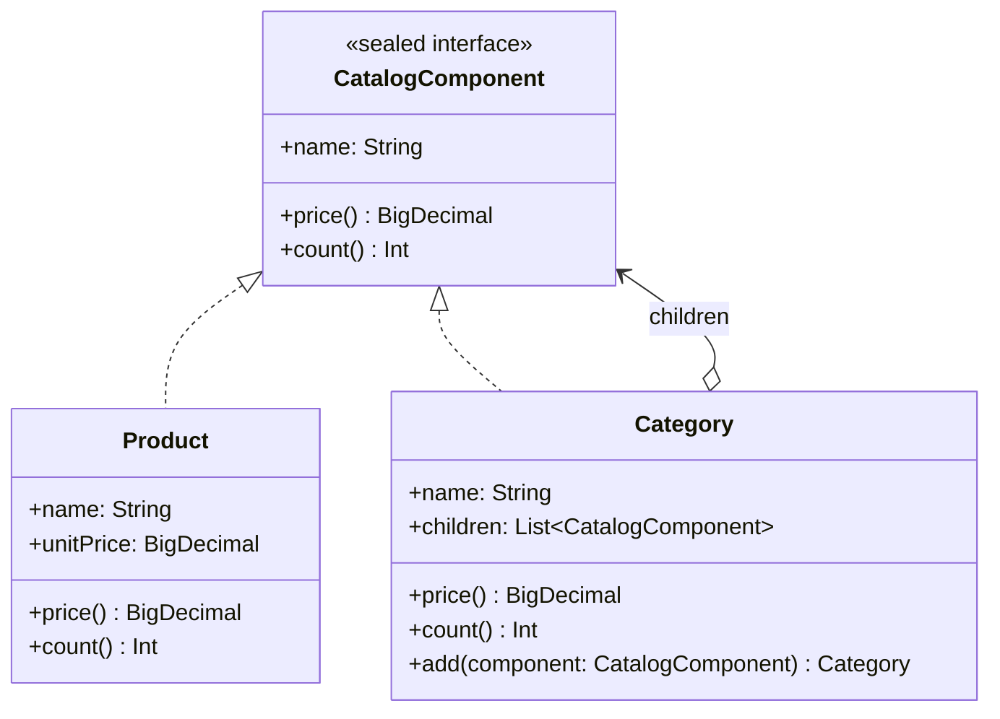

# Composite

## Définition

Le Composite organise des objets en structures arborescentes pour représenter des hiérarchies partie-tout. Il permet aux clients de traiter de manière uniforme les objets individuels (feuilles) et les compositions d'objets (noeud composites).

## Problème

Un catalogue e-commerce contient des **produits** individuels et des **catégories** qui regroupent d'autres produits ou sous-catégories. Pour calculer le prix total ou compter les articles, le client doit traiter différemment les produits (prix unitaire) et les catégories (somme récursive des enfants). Sans Composite, le code client est truffé de `if/else` et de cast, et chaque nouvelle opération duplique cette logique de parcours.

## Solution

On définit une interface commune `CatalogComponent` avec les opérations `price()` et `count()` :
1. **Feuille** (`Product`) : retourne son prix unitaire et compte 1.
2. **Composite** (`Category`) : délègue aux enfants et agrège les résultats.

Le client manipule uniquement `CatalogComponent` sans se soucier du type concret.

## Quand l'utiliser

- Structure hiérarchique naturelle (catalogue, système de fichiers, organisation, menu UI).
- Le client doit pouvoir traiter feuilles et composites de manière identique.
- Des opérations récursives (prix total, comptage, recherche) doivent s'appliquer a tout l'arbre.
- La profondeur de l'arbre est variable et non connue a l'avance.

## Quand éviter

- Si la structure est plate (pas de hiérarchie) : une simple `List` suffit.
- Si les feuilles et les composites ont des comportements radicalement différents que l'interface commune ne peut pas capturer proprement.
- Si l'arbre est mutable et nécessite des opérations complexes de réorganisation (préférer un arbre mutable dédié).

## Schéma

Commande pour exécuter :
`./gradlew :patterns:structural:composite:test`

## Trade-offs

| Avantages | Inconvénients |
|---|---|
| Interface uniforme pour feuilles et composites | Les opérations qui n'ont de sens que pour les composites (ex: `add`) polluent l'interface ou nécessitent un cast |
| Ajout de nouvelles opérations récursives simplifié | Performance : parcours récursif sur de très grands arbres |
| Immutabilité élimine les effets de bord | Création de nombreuses copies en cas de modifications fréquentes |
| `sealed` permet un pattern matching exhaustif | La hiérarchie fermée empêche l'extension par des tiers |

## À retenir

1. Le Composite permet de traiter un élément et un groupe d'éléments **exactement de la même manière** -> le client ignore la profondeur de l'arbre.
2. Il simplifie radicalement le code client : une seule méthode (`price()`, `render()`, `count()`) traverse toute la hiérarchie récursivement.
3. La structure est **extensible** : ajouter un nouveau type de feuille ou de composite ne casse aucun code existant.
4. Le pattern est naturel pour toute structure arborescente : catalogues, menus, systèmes de fichiers, organigrammes.
5. L'uniformité a un coût : certaines opérations n'ont de sens que pour les feuilles ou les composites, il faut gérer cette asymétrie.
