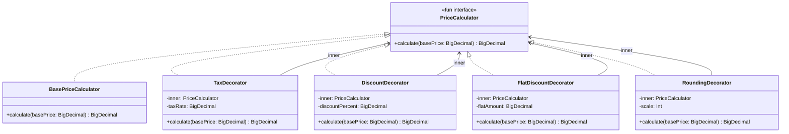

# Decorator

## Définition

Le Decorator attache dynamiquement des responsabilités supplémentaires a un objet. Il offre une alternative flexible a l'héritage pour étendre les fonctionnalités, en empilant des couches de comportement autour d'un objet de base.

## Problème

Un système de pricing e-commerce doit calculer le prix final d'un produit en appliquant différentes transformations : taxe (TVA), remise promotionnelle, arrondi. Ces transformations doivent être **combinables** dans n'importe quel ordre et **extensibles** sans modifier le code existant. Créer une sous-classe pour chaque combinaison (`PriceWithTax`, `PriceWithTaxAndDiscount`, `PriceWithDiscountAndRounding`...) mène a une explosion de classes.

## Solution

On définit une interface `PriceCalculator` avec une seule méthode `calculate(basePrice)`. Chaque decorator :
1. Implémente `PriceCalculator`.
2. Encapsule un autre `PriceCalculator` (le `inner`).
3. Appelle `inner.calculate()` puis applique sa transformation.

Les decorators s'empilent comme des poupées russes : `RoundingDecorator(TaxDecorator(DiscountDecorator(base)))`.

## Quand l'utiliser

- Besoin d'ajouter des responsabilités a un objet dynamiquement, sans modifier sa classe.
- Les combinaisons de comportements sont nombreuses et imprévisibles.
- L'héritage est inadapté (trop de sous-classes, ou la classe est `final`).
- Pipeline de transformations ou middlewares (logging, caching, validation, pricing).

## Quand éviter

- Si une seule combinaison fixe est utilisée : un simple appel de fonction suffit.
- Si l'ordre des decorators peut créer des bugs.
- Si le nombre de couches est très élevé : le debugging peut devenir difficile (stack trace profonde).
- Si la performance est critique et que chaque indirection compte.

## Schéma

Commande pour exécuter :
`./gradlew :patterns:structural:decorator:test`

## Trade-offs

| Avantages | Inconvénients                                                           |
|---|-------------------------------------------------------------------------|
| Combinaison flexible de comportements a l'exécution | L'ordre d'empilement affecte le résultat -> source de bugs              |
| Respecte Open/Closed : nouveau decorator = nouvelle classe, pas de modification | Debugging complexe avec de nombreuses couches                           |
| Chaque decorator a une responsabilité unique (SRP) | Beaucoup de petites classes si les transformations sont nombreuses      |
| `fun interface` permet des implémentations lambda légères | Le client doit construire la chaîne -> un Builder ou Factory peut aider |

## À retenir

1. Le Decorator permet de **combiner des comportements à la carte** sans créer une sous-classe par combinaison (évite l'explosion de classes).
2. L'empilement est dynamique : on compose le pipeline au runtime selon le contexte (rôle utilisateur, configuration, feature flags).
3. Chaque decorator respecte le Single Responsibility Principle : une seule transformation par classe, testable isolément.
4. L'ordre d'empilement définit le pipeline de calcul -> c'est à la fois sa force (flexibilité) et son piège (sensibilité à l'ordre).
5. Le pattern est naturel pour les pipelines de pricing, logging, caching, validation et middleware.
