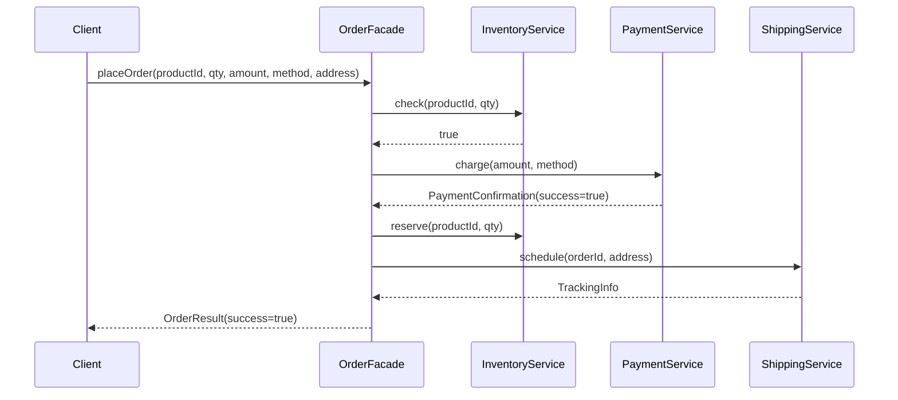

# Facade

## Définition

La Facade fournit une interface simplifiée a un ensemble de sous-systèmes complexes. Elle ne masque pas les sous-systèmes (qui restent accessibles directement), mais offre un point d'entrée unifié pour les cas d'usage courants.

## Problème

Passer une commande e-commerce implique l'orchestration de trois sous-systèmes :
1. **InventoryService** : vérifier et réserver le stock.
2. **PaymentService** : encaisser le paiement.
3. **ShippingService** : planifier la livraison.

Le client doit connaître l'ordre d'appel (vérifier le stock avant de payer, payer avant de réserver, réserver avant d'expédier), gérer les erreurs partielles (paiement refusé après vérification du stock) et manipuler les types de retour de chaque service. Cette complexité d'orchestration n'a pas sa place dans le code client.

## Solution

`OrderFacade` expose une seule méthode `placeOrder(...)` qui :
1. Vérifie la disponibilité du stock.
2. Encaisse le paiement.
3. Réserve le stock.
4. Planifie l'expédition.
5. Retourne un `OrderResult` unifié (succès ou échec avec message).

Le client passe d'un enchaînement complexe de 4 appels avec gestion d'erreurs a un seul appel.

## Quand l'utiliser

- Simplifier l'accès a un ensemble de sous-systèmes pour les cas d'usage courants.
- Découpler le code client de l'orchestration interne.
- Fournir un point d'entrée pour une couche d'API (controller, use case).
- Réduire les dépendances du client : il dépend de la facade plutôt que de N services.

## Quand éviter

- Si la facade devient un "God Object" qui absorbe toute la logique métier.
- Si le client a besoin d'un contrôle fin sur chaque sous-système (la facade masque les détails).
- Si un seul sous-système est impliqué : la facade n'apporte rien.
- Si la facade ne fait que relayer les appels sans orchestration : elle devient un pass-through inutile.

## Schéma

Commande pour exécuter :
`./gradlew :patterns:structural:facade:test`

## Trade-offs

| Avantages | Inconvénients |
|---|---|
| Réduit la complexité apparente pour le client | Peut devenir un God Object si mal contrôlé |
| Découple le client de l'orchestration interne | Masque des détails parfois nécessaires au client |
| Point d'entrée unique = plus facile a documenter et tester | Ajout d'une couche d'indirection |
| Les sous-systèmes restent utilisables directement | La facade peut dupliquer de la logique si l'orchestration varie |

## À retenir

1. La Facade offre un **point d'entrée unique** et simplifié pour un sous-système complexe -> le client n'a pas besoin d'en connaître les détails internes.
2. Elle réduit le couplage : le client dépend d'une seule classe au lieu de N sous-systèmes, ce qui limite l'impact des changements.
3. La Facade **simplifie** sans **remplacer** : les sous-systèmes restent accessibles directement pour les cas avancés.
4. Elle est idéale pour l'orchestration de workflows multi-étapes (commande, inscription, déploiement).
5. Attention au piège du God Object : la Facade orchestre mais ne contient jamais de logique métier.
