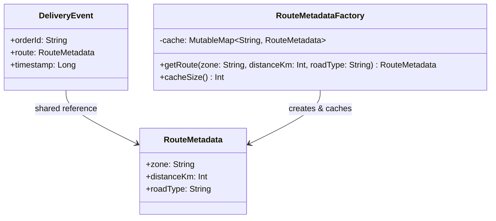

# Flyweight

## Définition

Le Flyweight réduit la consommation mémoire en partageant les données communes (état intrinsèque) entre un grand nombre d'objets similaires, plutôt que de stocker ces données dans chaque instance. L'état variable (extrinsèque) reste propre a chaque objet.

## Problème

Un système de logistique enregistre des milliers d'événements de livraison (`DeliveryEvent`) par jour. Chaque événement contient les métadonnées de sa route : zone géographique, distance en km et type de route. Or, la majorité des livraisons partagent les mêmes routes. Stocker une copie complète des métadonnées dans chaque événement gaspille de la mémoire : 10 000 livraisons sur 50 routes distinctes créent 10 000 objets `RouteMetadata` au lieu de 50.

## Solution

On sépare l'état en deux parties :
1. **État intrinsèque** (`RouteMetadata`) : immutable et partageable -- zone, distance, type de route.
2. **État extrinsèque** (`DeliveryEvent`) : propre a chaque instance -- orderId, timestamp.

Une **factory** (`RouteMetadataFactory`) maintient un cache et retourne toujours la même instance de `RouteMetadata` pour des paramètres identiques. Les `DeliveryEvent` référencent l'objet partagé au lieu de posséder leur propre copie.

## Quand l'utiliser

- Un très grand nombre d'objets partagent des données communes (routes, icônes, polices, tuiles de carte).
- La mémoire est une contrainte (mobile, systèmes embarqués, volumes massifs).
- L'état partagé est **immutable** (obligatoire pour un partage sûr).
- La factory peut centraliser la logique de cache.

## Quand éviter

- Si le nombre d'objets est faible : le cache ajoute de la complexité sans bénéfice.
- Si l'état "partageable" est en réalité souvent unique : le cache ne réduit rien.
- Si l'état intrinsèque est mutable : le partage introduit des bugs de concurrence.
- Si la complexité du cache (éviction, thread-safety) dépasse le gain mémoire.

## Schéma

Commande pour exécuter :
`./gradlew :patterns:structural:flyweight:test`

## Trade-offs

| Avantages | Inconvénients                                                               |
|---|-----------------------------------------------------------------------------|
| Réduction drastique de la mémoire pour les données répétitives | Complexité accrue : séparation intrinsèque/extrinsèque                      |
| Cache centralisé = création contrôlée | Le cache peut fuir (memory leak) sans politique d'éviction                  |
| Immutabilité des flyweights = thread-safe par nature | L'identité référentielle remplace l'identité logique -> source de confusion |
| Performance : moins d'allocations = moins de GC pressure | La factory peut devenir un goulot d'étranglement en concurrent              |

## À retenir

1. Le Flyweight **réduit drastiquement l'empreinte mémoire** en partageant les données communes entre des milliers d'objets similaires.
2. La séparation état intrinsèque (partagé) / extrinsèque (par instance) est le coeur du pattern : elle identifie ce qui peut être mutualisé.
3. Le pattern n'a de sens que si le nombre d'objets est **grand** et les données partagées **répétitives** -> le mesurer avant de l'appliquer.
4. Il rend possible des systèmes qui seraient autrement impossibles en mémoire (rendu de texte, cartes, jeux, catalogues massifs).
5. Le Flyweight impose l'**immutabilité** de l'état partagé : c'est à la fois sa contrainte et sa garantie de thread-safety.
