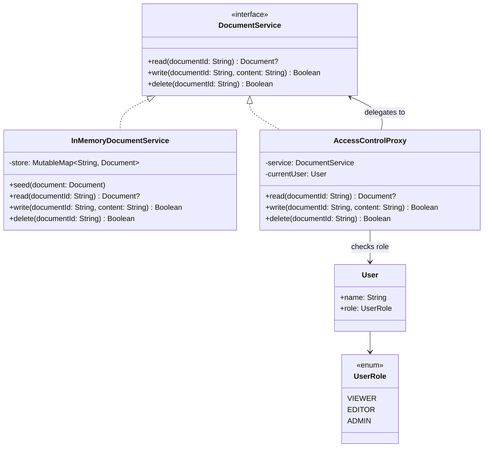

# Proxy

## Définition

Le Proxy fournit un substitut ou un remplaçant pour un autre objet afin d'en contrôler l'accès. Il implémente la même interface que l'objet réel et intercepte les appels pour ajouter un comportement transversal (contrôle d'accès, cache, logging, lazy loading).

## Problème

Un service de gestion documentaire (`DocumentService`) permet de lire, écrire et supprimer des documents. Tous les utilisateurs accèdent au même service, mais les règles métier imposent des restrictions :
- Un **VIEWER** ne peut que lire.
- Un **EDITOR** peut lire et écrire.
- Un **ADMIN** peut lire, écrire et supprimer.

Intégrer ces vérifications directement dans le service viole le Single Responsibility Principle : le service mélange logique métier (CRUD) et logique de sécurité (contrôle d'accès). Chaque nouveau rôle ou nouvelle règle nécessite de modifier le service.

## Solution

On crée un `AccessControlProxy` qui :
1. Implémente `DocumentService` (même interface que le service réel).
2. Détient une référence vers le service réel et le `User` courant.
3. Intercepte chaque appel pour vérifier le rôle avant de déléguer au service réel.
4. Lance une `AccessDeniedException` si le rôle est insuffisant.

Le client manipule `DocumentService` sans savoir s'il parle au service réel ou au proxy.

## Quand l'utiliser

- **Protection Proxy** : contrôle d'accès basé sur les rôles ou permissions (cas présenté ici).
- **Virtual Proxy** : chargement lazy d'objets coûteux (images, connexions BDD).
- **Caching Proxy** : mise en cache transparente des résultats.
- **Logging Proxy** : audit des appels sans modifier le service.
- **Remote Proxy** : abstraction d'un appel réseau derrière une interface locale.

## Quand éviter

- Si le contrôle d'accès est déja géré par un framework (Spring Security, etc.) : le proxy ferait doublon.
- Si l'interface du service est trop large : le proxy doit implémenter toutes les méthodes, même celles sans logique ajoutée.
- Si la performance est critique et que l'indirection du proxy est mesurable.
- Si le proxy accumule trop de responsabilités (cache + logging + accès) : préférer des decorators chaînés.

## Schéma

Commande pour exécuter :
`./gradlew :patterns:structural:proxy:test`

## Trade-offs

| Avantages                                                            | Inconvénients |
|----------------------------------------------------------------------|---|
| Séparation nette entre logique métier et contrôle d'accès (SRP)      | Le proxy doit implémenter toute l'interface, même les méthodes pass-through |
| Le client ne dépend que de l'interface -> le proxy est transparent   | Indirection supplémentaire a chaque appel |
| Facilement testable : on teste le proxy et le service indépendamment | Risque de désynchronisation si l'interface évolue |
| Extensible : on peut ajouter des rôles sans modifier le service réel | Accumulation de responsabilités si le proxy gère trop de préoccupations |

## À retenir

1. Le Proxy ajoute du **contrôle** (sécurité, cache, lazy loading) de manière **transparente** : le client utilise la même interface sans savoir qu'un proxy intervient.
2. Il respecte le Single Responsibility Principle : la logique d'accès (authentification, autorisation, audit) est isolée du service métier.
3. Le pattern se décline en plusieurs variantes (protection, virtual, caching, logging, remote) mais le principe reste identique : interception transparente.
4. Le Proxy est indispensable pour les **préoccupations transversales** sans polluer le code métier.
5. Différence clé avec le Decorator : le Proxy contrôle l'**accès**, le Decorator enrichit les **fonctionnalités**.
